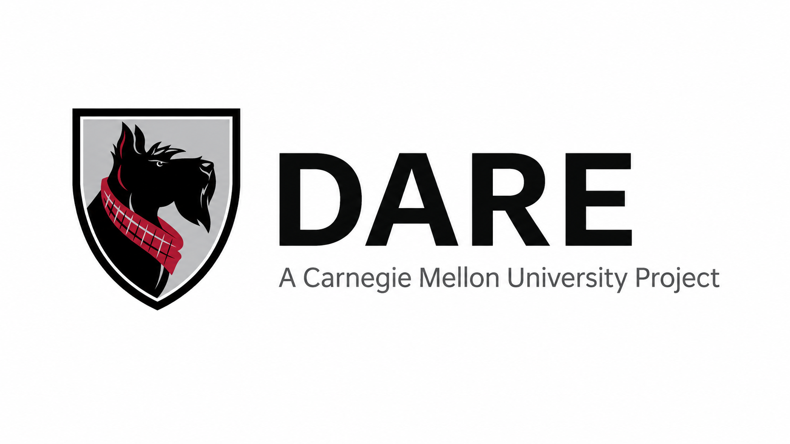
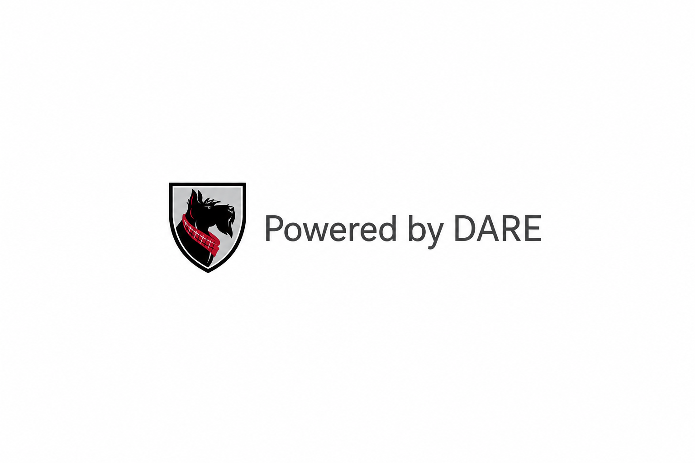
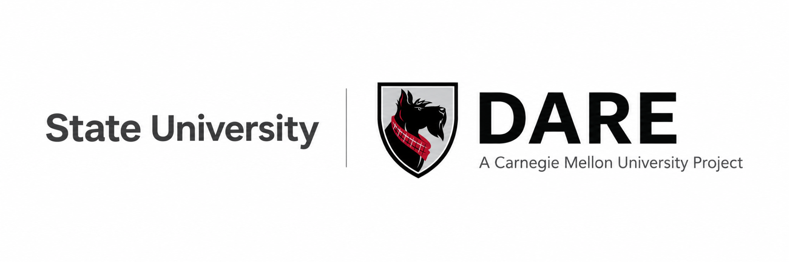
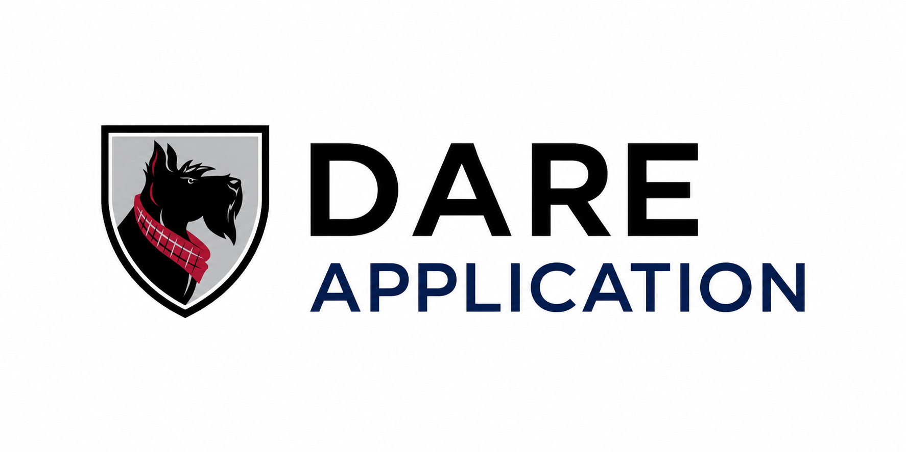

# DARE Brand Guidelines & Usage Policy

**Dietrich Analysis Research Education (DARE) Platform**

An Open Forum for AI (OFAI) initiative, Carnegie Mellon University Libraries

Version 0.1 — May 2026

---

## 1. About This Document

This document governs the use of the Dietrich Analysis Research Education (DARE) name, marks, and associated branding. It is a separate instrument from the software license and governs only the DARE name, wordmark, and visual identity — not the underlying code.

The DARE codebase is released under AGPL-3.0. That license governs what you may do with the code. This document governs what you may do with the DARE name and marks.

**These are independent instruments.** Your rights under the software license do not grant you rights to the DARE name or marks. Conversely, compliance with this brand policy does not modify your obligations under the software license.

### How the license and brand work together

The DARE software license requires anyone who distributes or deploys a modified version to publish their source code and attach the license to any derivative. This means the lineage of any DARE-derived software is always visible in the code itself, regardless of what the derivative is called. You do not need to use the DARE name or marks to fulfill your obligations under the software license.

If you modify DARE and release it under a different name, you are free to do so under the software license, provided you comply with its terms. You may not, however, call your product "DARE" or display the DARE marks without complying with this policy.

---

## 2. The DARE Brand System

### 2a. DARE Name Usage

DARE — Dietrich Analysis Research Education — must always appear in all capital letters with no punctuation separating the letters: **DARE**. It must never appear as "Dare," "D.A.R.E.," or any other variation. On first reference in any document or communication, use "Dietrich Analysis Research Education (DARE) Platform." Subsequent references may use "DARE" alone.

### 2b. Header Lockup

The canonical DARE header lockup is:

The Scotty dog mark appears to the left of the wordmark. "DARE" appears as the primary wordmark. "A Carnegie Mellon University Project" appears beneath it in smaller text as a descriptor. Any deployment that uses the DARE name must display this lockup in the header. It may not be modified, and "A Carnegie Mellon University Project" may not be removed.

### 2c. Footer Badge

Any deployment that uses the DARE name must display the following in the footer:

Use of the Scotty mark in the header lockup and footer badge is authorized by Carnegie Mellon University for all compliant DARE deployments.

### 2d. Protected Marks

The following are protected marks owned by Carnegie Mellon University:

- **DARE** — wordmark, always in all capitals
- **Dietrich Analysis Research Education** — full name
- **"A Carnegie Mellon University Project"** — descriptor as used in the header lockup
- **"Powered by DARE"** — attribution phrase
- **"An Open Forum for AI (OFAI) initiative, Carnegie Mellon University Libraries"** — descriptor phrase
- **CMU Scotty dog mark** — as used in the header lockup and footer badge

---

## 3. What You Can Always Do

Anyone who deploys or builds on DARE under the software license may, regardless of brand compliance:

- State factually that their product is "based on DARE," "built on DARE," or "derived from DARE" in documentation, blog posts, or communications
- Link to the DARE repository or website
- Describe DARE accurately in academic publications, grant applications, or conference presentations
- Use the DARE name in truthful comparisons or academic analysis
- Rename their deployment entirely and operate it without using the DARE name or marks, provided they comply with the software license

---

## 4. Using the DARE Name and Marks

If you wish to use the DARE name or marks in your deployment, you must comply with this section. If you rename your deployment entirely, this section does not apply — your obligations are governed solely by the software license.

### Tier 1: Community Deployment

**Who this is for:** Any institution or individual deploying DARE under the software license without a formal agreement with CMU or OFAI, who wishes to use the DARE name.

**Required:**

- DARE header lockup (Scotty + "DARE / A Carnegie Mellon University Project") in the UI header
- Scotty + "Powered by DARE" footer badge in the UI footer

**Not permitted:**

- Institution name or mark in the header alongside the DARE lockup
- Implying CMU or OFAI endorsement of your specific deployment
- Modifying the header lockup or footer badge in any way

**No application required.** Deploy under the software license, comply with these requirements, and you may use the DARE name.

### Tier 2: Partner Deployment

**Who this is for:** Institutions with a formal partnership agreement with CMU / OFAI who wish to use the DARE name with institutional co-branding.

**Required:**

- All Tier 1 requirements
- "Powered by DARE, an Open Forum for AI (OFAI) initiative, Carnegie Mellon University Libraries" in the footer

**Permitted additionally:**

- Your institution's name and mark displayed in the header alongside the DARE lockup (e.g., "State University DARE — A Carnegie Mellon University Project")
- Full co-labeling in the header; the DARE lockup and "A Carnegie Mellon University Project" descriptor must remain present and unmodified

For information about DARE partnerships, including what partnership involves and how to explore it, see \[DARE Partnership Guide — link TBD\].

### Tier 3: Contributor Recognition

Substantial contributors to the DARE codebase may be awarded a DARE Contributor badge at the discretion of the project maintainers. This is a separate recognition mark, not a deployment tier, and carries its own usage guidelines. Details at \[CONTRIBUTING.md — link TBD\].

---

## 5. Forks and Derivative Works

If you modify DARE and release it under a different name, you may not use the DARE name or marks as the primary identity of your product, and you may not imply that your derivative is the official DARE project or is endorsed by CMU or OFAI. Your obligations regarding source code, licensing, and attribution are governed by the software license, not this document.

---

## 6. What Is Not Permitted

The following are not permitted without explicit written authorization from CMU:

- Using the DARE name or marks while not complying with the requirements of the applicable tier
- Using the DARE name or marks to imply CMU or OFAI endorsement of a product, service, or organization
- Modifying the DARE wordmark, header lockup, or footer badge in any way
- Displaying "DARE" in anything other than all capital letters
- Using the DARE name as part of a new product name (e.g., "DARE Pro," "DARE Enterprise") without a written agreement

---

## 7. White Labeling

You are free under the software license to deploy a modified or unmodified version of DARE without using the DARE name or marks. No attribution to DARE is required in your UI provided you comply with the software license terms, including source disclosure and license attachment.

If you wish to deploy under the DARE name while removing or significantly modifying the standard brand elements, contact \[dare@cmu.edu\] to discuss a custom agreement. Such agreements are evaluated on a case-by-case basis and are not guaranteed.

---

## 8. Sub-Projects and the DARE Ecosystem

Additional tools released as part of the DARE ecosystem follow a consistent sub-project branding pattern:

The DARE lockup sits above the application name, establishing lineage to the broader DARE ecosystem. Each sub-project carries its own software license and IP disclosure. Compliance with this brand policy applies to each sub-project independently.

---

## 9. Commercial Use

The DARE software license permits commercial use subject to its copyleft provisions. This brand policy does not restrict commercial use of the software. Commercial entities deploying DARE under the DARE name must comply with the attribution requirements of their applicable tier. Those wishing to use the DARE name in a commercial product or service should contact \[dare@cmu.edu\].

---

## 10. Academic and Research Use

Academic publications, conference presentations, grant applications, and research reports may reference DARE freely and accurately. On first reference use "Dietrich Analysis Research Education (DARE) Platform." Attribution to Carnegie Mellon University and the Open Forum for AI is appreciated but not required in academic contexts beyond standard citation practice.

---

## 11. Questions and Permissions

For questions about this policy or to request permissions not covered here:

**Email:** \[dare@cmu.edu — TBD\]

**Website:** \[DARE project URL — TBD\]

This policy may be updated as the DARE project evolves. The version number and date at the top of this document reflect the current version. Substantive changes will be announced through the DARE community channel.

---

*The Dietrich Analysis Research Education (DARE) Platform is an Open Forum for AI (OFAI) initiative, Carnegie Mellon University Libraries. The DARE name and marks are owned by Carnegie Mellon University. The DARE software is released under \[GPL 2.0 / AGPL-3.0 — TBD\]. Copyright Carnegie Mellon University.*
