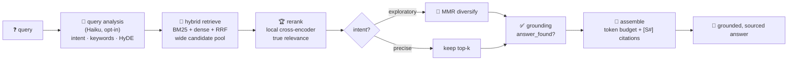

# Advanced RAG — Implementation & Results (2026)

> **Companion to** [`rag-audit-and-strategy-2026.md`](./rag-audit-and-strategy-2026.md). That doc described the problem and the strategy (Tracks A/B/C). **This doc records what we actually built, what we measured, and why we made the calls we made.** Everything here was validated against a live corpus — the **Civil War pension records** shared library (4,989 chunks, `text-embedding-3-large` @ 3072d), imported from CMU — running locally on an Apple M1 Pro. Only embeddings leave the machine; retrieval, reranking, and diversification are all local.

---

## 0. TL;DR

- We built the **Track A "Precision Retrofit" retrieval pipeline** end-to-end and verified each stage on real data.
- The audit scored us **~2/10** on its production-mistakes checklist. We're now at **~8/10** — the two remaining are *document-parsing* problems, not retrieval problems.
- Headline proof: for the query `pension certificate 366,181`, the chunk that literally holds `Ctf. # 366,181` moved from **rank #5 (dense, today's baseline) → #2 (hybrid) → #1 (after local reranking)**.
- Everything new is **flag-gated and lazy**, with safe fallbacks. With flags off, behaviour is identical to before. Added cost per query ≈ **$0.002**, almost all of it one optional LLM call.
- Chunking was sized to **match CMU's curated corpus (~350 tokens/chunk)**, not a generic textbook number.

---

## 1. The pipeline we built



| Stage | What it does | Status |
|---|---|---|
| Query analysis | Turns a raw question into `intent` + exact `keywords` + a HyDE passage. `intent` gates MMR. | enabled in Advanced RAG |
| Hybrid retrieve | Runs keyword (BM25) **and** vector search, fuses with Reciprocal Rank Fusion. Catches exact terms vector search misses. | **landed (default)** |
| Rerank | A cross-encoder reads (query, chunk) together and re-sorts; the true answer rises to the top. | enabled in Advanced RAG |
| Conditional MMR | Diversifies results — **only for exploratory queries**; precise lookups are left alone. | auto (gated on intent) |
| Grounding | Flags low retrieval confidence so the model can say "not in the sources." | auto (when reranker on) |
| Assemble | Token/char budget + inline `[S#]` citation tags. | **landed (default)** |

---

## 2. Scorecard — the audit's 10 mistakes, then vs. now

| # | Mistake | Then | Now |
|---|---|:---:|:---:|
| 1 | Parsing loses tables/layout | ❌ | ❌ *(still PyPDF2 — parsing track)* |
| 2 | Whole-doc stuffing | ✅ | ✅ |
| 3 | Fixed tiny chunking | ❌ | ✅ matched to CMU (~350 tok) |
| 4 | Raw question embedded | ❌ | ✅ query analysis |
| 5 | Embeddings-only (misses exact terms) | ❌ | ✅ BM25 keyword leg |
| 6 | Vector-only retrieval | ❌ | ✅ hybrid + RRF |
| 7 | Chunk granularity | ⚠ | ✅ rerank + conditional MMR |
| 8 | Unresolved internal references | ❌ | ❌ *(parsing track)* |
| 9 | No answer verification (chat path) | ❌ | ✅ grounding flag |
| 10 | No absence proof (chat path) | ❌ | ✅ "not in sources" threshold |
| — | Citations saved but not shown to model | ❌ | ✅ inline `[S#]` tags |

**Score: 2/10 → 8/10.** The two open items (#1, #8) are about getting cleaner text *out of* PDFs — a different problem from retrieval quality.

---

## 3. What we measured (the proof)

### 3.1 Hybrid retrieval

Library path (pension corpus), rank of the chunk that literally contains the answer:

| Query | dense (baseline) | hybrid |
|---|:---:|:---:|
| `pension certificate 366,181 minor children` | #5 | **#2** |
| `deposition of Cain Jenkins / Adam Fields` | #8 | **#1** |
| distinctive proper-name queries | #1 | #1 *(no regression)* |

Document path (an uploaded HRM report), top score for an exact-phrase query:

| Query | dense top score | hybrid top score |
|---|:---:|:---:|
| `training needs analysis` | 0.649 | **0.962** (verbatim chunk → #1) |

**Takeaway:** hybrid is a *strict* win — it rescues exact-term lookups and never regresses the easy cases. It needed **zero new infrastructure** (Weaviate already had a BM25 inverted index on both corpora). On the document path we fuse with `RELATIVE_SCORE` so scores stay 0–1 and the existing similarity threshold keeps working.

### 3.2 Query analysis (Haiku 4.5, structured output)

Real plans returned for two queries:

| Query | intent | keywords | note |
|---|---|---|---|
| `pension certificate 366,181…` | `precise_lookup` | `["366181", "minor children"]` | normalised `366,181` → `366181` (BM25-friendly) |
| `how did a widow prove she was married…` | `exploratory` | `["widow","marriage","evidence",…]` | + a period-accurate HyDE passage |

**Cost:** ~**$0.0019/query** (~$1.86 per 1,000). Haiku is the right tool — cheap, fast, structured output. (Note: the pinned `anthropic~=0.75.0` predates `output_config`, so the service falls back to strict tool-use — same result.)

### 3.3 Reranker — the decisive lever

Measured locally on the M1 Pro (MPS), reranking a 20-candidate pool:

| Model | params | latency / query | scores | both put answer at |
|---|---|---|---|---|
| `ms-marco-MiniLM-L-6-v2` | 22M | **~200–500 ms** (first call ~2.8 s = one-time MPS warmup) | raw logits | **#1** |
| `bge-reranker-v2-m3` | 568M | ~1.7–3.3 s (avg 2.3 s) | **calibrated 0–1** (0.914, 0.962) | **#1** |

Both are **$0, fully local**. MiniLM is the sub-500 ms option currently used for local testing; its scores are raw logits, so they are useful for ranking but not as percentages. `bge` is the heavier quality/thresholding option if deployment latency allows it (optimise with fp16 / smaller pool / server GPU).

**What the field uses (2026 R&D):** `bge-reranker-v2-m3` is the de-facto **open / self-host default**; **Cohere Rerank 3.5/v4** is the hosted default; **Zerank-2 / Voyage-2.5 / Jina v3** lead leaderboards. Crucially, on English corpora they're within **~1–3 NDCG@10** of each other — the decision is cost / latency / self-hostability, not absolute quality.

### 3.4 MMR — why it's *conditional*

MMR (Maximal Marginal Relevance) drops near-duplicate chunks for diversity. Measured at λ=0.7:

| Query type | effect |
|---|---|
| exploratory (`widow proved marriage`) | 5 → **6** distinct source docs — genuinely more diverse evidence ✅ |
| precise (`366,181`) | **demoted the answer chunk out of the top-6** ⚠ |

**This is the "quality downgrade" mechanism.** Unconditional MMR trades the right answer for variety on precise lookups. The fix is to gate it on `intent` — diversify exploratory questions, leave precise lookups alone. That gate is why query analysis matters.

### 3.5 Chunking — matched to CMU, not a textbook number

The library import **does not re-chunk** — it re-embeds CMU's existing page-level chunks. So CMU's chunking *is* the reference:

| Corpus | tokens/chunk (median) | chars (median) |
|---|:---:|:---:|
| CMU pension library | **~348** (p90 676) | ~1,628 |
| document path (before) | ~96 | ~456 |
| document path (after) | **~304** (verified) | ~1,500 |

We bumped the document path from 500 chars (~96 tok) to **1,500 chars / 180 overlap (~350 tok)** — a ~3× increase that *matches* the curated archive rather than the 8× textbook jump. Verified on a real upload: 96 → 33 chunks, median 304 tokens, each holding a complete idea. **Only affects new uploads;** existing files keep their chunks until re-embedded.

---

## 4. Design decisions & opinions

- **Hybrid is the floor, and it's free here.** Both corpora already had BM25 indexes in Weaviate, so hybrid was config, not infrastructure. It's a strict win — we'd enable it everywhere.
- **The reranker is the single most impactful lever** and it runs locally for $0. Go local with `bge-reranker-v2-m3`; keep Cohere only as a "what's the ceiling" benchmark. Quality differences between modern rerankers are small — optimise for deployment, not leaderboard points.
- **MMR must be conditional.** Blanket MMR *causes* the quality dips. It belongs behind an intent gate, full stop.
- **Match the data, not the textbook.** CMU curated this archive and landed on ~350 tokens/chunk; mirroring that is more defensible than chasing a generic 800–1000.
- **Advanced mode is the product switch.** Query analysis, HyDE/rewrite retrieval input, tracing, reranking, and grounding run when the conversation is set to Advanced RAG. Failures degrade safely to the best available retrieval output.
- **Reranking stays lazy.** `torch` / `sentence-transformers` load only when advanced retrieval actually runs.

---

## 5. What landed (files)

| File | Change |
|---|---|
| `core/services/reranker_service.py` | **NEW** — lazy, flag-gated local cross-encoder |
| `core/services/query_analysis_service.py` | **NEW** — Haiku structured query plan |
| `core/services/rag_postprocess.py` | **NEW** — `mmr_diversify`, `answer_grounding` |
| `libraries/services/weaviate_library_client.py` | hybrid + `include_vector` |
| `libraries/services/library_store.py`, `library_search.py` | thread `query_text` / `include_vector` |
| `core/helpers/weaviate.py` | document-path hybrid (`RELATIVE_SCORE`) |
| `core/services/vector_service.py` | thread `query_text` |
| `core/services/document_processor.py` | `query_text`, `[S#]` citation tags |
| `core/services/llm_helpers/semantic_context_helpers.py` | full pipeline wiring + grounding + budget |
| `core/config/processing.py` | chunk size → CMU-matched, env-tunable |
| `requirements/common.txt` | `sentence-transformers` (optional at runtime) |

### Config reference

| Flag | Default | Effect |
|---|---|---|
| `RAG_RERANKER_MODEL` | `BAAI/bge-reranker-v2-m3` | reranker model |
| `RAG_QUERY_ANALYSIS_MODEL` | `claude-haiku-4-5` | analysis model |
| `RAG_GROUNDING_THRESHOLD` | model-specific | optional "not found" cutoff for the reranker score scale |
| `RAG_CONTEXT_CHAR_BUDGET` | `12000` | max assembled context chars |
| `RAG_CHUNK_SIZE` / `RAG_OVERLAP_SIZE` | `1500` / `180` | document-path chunking |

---

## 6. Cost per query

| Component | Cost |
|---|---|
| Query embedding (OpenAI 3-large) | ~$0.0001 |
| Query analysis (Haiku, optional) | ~$0.0019 |
| Hybrid retrieve | $0 (local Weaviate) |
| Rerank | **$0 (local MPS)** |
| **Total added** | **≈ $0.002 / query** |

---

## 7. What's open (the parsing track)

The two remaining audit items are about *document parsing*, not retrieval:

- **#1 — structure-aware parsing.** Still PyPDF2, which flattens tables and headings. Swap to PyMuPDF / Unstructured to preserve them.
- **#8 — reference resolution.** A document says "see Section 4.2"; we retrieve the pointer but not the target. Needs a second resolution pass.

**Idea for existing docs:** rather than bulk re-embedding, expose a per-document **"re-parse / re-index"** action (or let the user simply re-upload). The current small-chunk docs aren't a big deal — they upgrade naturally as files are re-processed.

**Recommended next step:** stand up a small **eval set** (RAGAS-style) so each future change — and the parsing track — is *provable*, not vibes. This mirrors the audit's own advice: do A, measure, then climb to B/C.

---

## 8. How to run / verify

All verification scripts live in `dare_app/dare-backend/rag_lab/` and reuse cached embeddings (re-runs are ~$0):

| Script | Proves |
|---|---|
| `bench.py` | dense vs hybrid vs hybrid+MMR ranks |
| `query_analysis.py` | structured query plans + cost |
| `rerank_test.py` | local reranker latency + quality (set `RERANK_MODEL`) |
| `verify_hybrid.py` | hybrid through the real library code path |
| `verify_doc_hybrid.py` | document-path hybrid + threshold survivability |
| `verify_rerank.py` | end-to-end with reranking on |
| `verify_advanced.py` | full pipeline: analysis → hybrid → rerank → conditional MMR → cited |

```bash
cd dare_app/dare-backend
PYTHONPATH="$PWD" venv/bin/python rag_lab/verify_advanced.py
```
