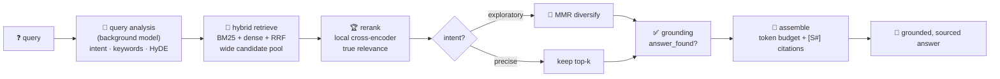

# Advanced RAG — Implementation & Results (2026)

> **Companion to** [`rag-audit-and-strategy-2026.md`](./rag-audit-and-strategy-2026.md). That doc described the problem and the strategy (Tracks A/B/C). **This doc records what we actually built, what we measured, and why we made the calls we made.** Everything here was validated against a live corpus — the **Civil War pension records** shared library (4,989 chunks, `text-embedding-3-large` @ 3072d), imported from CMU — running locally on an Apple M1 Pro. Only embeddings leave the machine; retrieval, reranking, and diversification are all local.

---

## 0. TL;DR

- We built the **Track A "Precision Retrofit" retrieval pipeline** end-to-end and verified each stage on real data.
- The audit scored us **~2/10** on its production-mistakes checklist. All **10/10 checklist capabilities** are now present, including Docling-backed structure-aware chunks and one-hop internal-reference resolution. This is a capability score, not a claim that retrieval quality is perfect.
- Headline proof: for the query `pension certificate 366,181`, the chunk that literally holds `Ctf. # 366,181` moved from **rank #5 (dense, today's baseline) → #2 (hybrid) → #1 (after local reranking)**.
- Everything new is **flag-gated and lazy**, with safe fallbacks. With flags off, behaviour is identical to before. Query-analysis cost follows the user's selected background model and wallet.
- Chunking was sized to **match CMU's curated corpus (~350 tokens/chunk)**, not a generic textbook number.

---

## 1. The pipeline we built


```mermaid
flowchart LR
    Q["❓ query"] --> QA["🧠 query analysis<br/>(background model)<br/>intent · keywords · HyDE"]
    QA --> HR["🔀 hybrid retrieve<br/>BM25 + dense + RRF<br/>wide candidate pool"]
    HR --> RR["🏆 rerank<br/>local cross-encoder<br/>true relevance"]
    RR --> MMR{"intent?"}
    MMR -->|exploratory| DIV["🌿 MMR diversify"]
    MMR -->|precise| KEEP["keep top-k"]
    DIV --> GR["✅ grounding<br/>answer_found?"]
    KEEP --> GR
    GR --> AS["📝 assemble<br/>token budget + [S#] citations"]
    AS --> ANS["🤖 grounded, sourced answer"]
```

| Stage | What it does | Status |
|---|---|---|
| Query analysis | Turns a raw question into `intent` + exact `keywords` + a HyDE passage. `intent` gates MMR. | enabled in Advanced RAG |
| Hybrid retrieve | Runs keyword (BM25) **and** vector search, fuses with Reciprocal Rank Fusion. Catches exact terms vector search misses. | **landed (default)** |
| Graph expand | Follows stored in-document pointers (section, figure, table, chapter, appendix, page) one hop from each document hit and adds the targets to the candidate pool with the pointer recorded. | **landed (document path, flag-gated)** |
| Rerank | A cross-encoder reads (query, chunk) together and re-sorts; the true answer rises to the top. | enabled in Advanced RAG |
| Conditional MMR | Diversifies results — **only for exploratory queries**; precise lookups are left alone. | auto (gated on intent) |
| Grounding | Flags low retrieval confidence so the model can say "not in the sources." | auto (when reranker on) |
| Assemble | Token/char budget + inline `[S#]` citation tags. | **landed (default)** |

---

## 2. Scorecard — the audit's 10 mistakes, then vs. now

| # | Mistake | Then | Now |
|---|---|:---:|:---:|
| 1 | Parsing loses tables/layout | ❌ | ✅ PyMuPDF structure-aware (PyPDF2 fallback) |
| 2 | Whole-doc stuffing | ✅ | ✅ |
| 3 | Fixed tiny chunking | ❌ | ✅ matched to CMU (~350 tok) |
| 4 | Raw question embedded | ❌ | ✅ query analysis |
| 5 | Embeddings-only (misses exact terms) | ❌ | ✅ BM25 keyword leg |
| 6 | Vector-only retrieval | ❌ | ✅ hybrid + RRF |
| 7 | Chunk granularity | ⚠ | ✅ rerank + conditional MMR |
| 8 | Unresolved internal references | ❌ | ✅ stored pointers + one-hop expand |
| 9 | No answer verification (chat path) | ❌ | ✅ grounding flag |
| 10 | No absence proof (chat path) | ❌ | ✅ "not in sources" threshold |
| — | Citations saved but not shown to model | ❌ | ✅ inline `[S#]` tags |

**Capability score: 2/10 → 10/10.** Item #8 is implemented by storing internal pointers during ingest and following a resolved target one hop during Advanced RAG retrieval. Corpus-specific quality still depends on the document exposing trustworthy headings, bookmarks, captions, or page anchors.

### The parsing upgrade (mistake #1), verified

`FileProcessor._read_pdf` now goes through **PyMuPDF** (lazy import, PyPDF2 as safe fallback):

- **Paragraph structure**: pages joined with a single space became one flat blob before; now text-block boundaries survive, so the splitter cuts on real paragraph edges. Barabási-Albert 1999 (two-column arXiv): 1 block → **294 blocks**, reading order verified contiguous across columns. The HRM report: 1 blob → **224 blocks** with headings intact.
- **Tables come out as markdown** (`page.find_tables()` → `to_markdown()`), emitted once at their reading position instead of flattened word soup. Proven end-to-end: a ruled pension-ledger PDF ingested through the real RQ worker path put `|366181|Harriet Fields|$12.00|` in a chunk; the query "monthly pension rate for certificate 366181" then hit it at **hybrid 1.000** (dense alone: 0.477 — the BM25 leg catches the exact number).
- **Chunk shape holds**: median stays in the CMU band (~290–305 tok) with slightly fewer mid-sentence chunk endings.

Also fixed while closing this out: existing users carried the old `chunk_size=500/overlap=100` **on their user rows**, which silently overrode the new CMU-matched defaults on every upload. A data migration (`users/0035`) bumps rows still holding both legacy defaults; customized values are untouched.

---

## 3. What we measured (the proof)

### 3.1 Hybrid retrieval

Library path (pension corpus), rank of the chunk that literally contains the answer:

| Query | dense (baseline) | hybrid |
|---|:---:|:---:|
| `pension certificate 366,181 minor children` | #5 | **#2** |
| `deposition of Cain Jenkins / Adam Fields` | #8 | **#1** |
| distinctive proper-name queries | #1 | #1 *(no regression)* |

Document path (an uploaded HRM report), top score for an exact-phrase query:

| Query | dense top score | hybrid top score |
|---|:---:|:---:|
| `training needs analysis` | 0.649 | **0.962** (verbatim chunk → #1) |

**Takeaway:** hybrid is a *strict* win — it rescues exact-term lookups and never regresses the easy cases. It needed **zero new infrastructure** (Weaviate already had a BM25 inverted index on both corpora). On the document path we fuse with `RELATIVE_SCORE` so scores stay 0–1 and the existing similarity threshold keeps working.

### 3.2 Query analysis (background model, structured output)

Real plans returned for two queries:

| Query | intent | keywords | note |
|---|---|---|---|
| `pension certificate 366,181…` | `precise_lookup` | `["366181", "minor children"]` | normalised `366,181` → `366181` (BM25-friendly) |
| `how did a widow prove she was married…` | `exploratory` | `["widow","marriage","evidence",…]` | + a period-accurate HyDE passage |

The query plan now uses the same background-model boundary as titles, summaries,
and memory extraction. DARE defaults to GPT-5.6 Luna; LiteLLM wallets use the
single background model selected for that proxy. Every call is attributed to the
active wallet, and any resolution, transport, or parsing failure safely falls
back to the raw query.

### 3.3 Reranker — the decisive lever

Measured locally on the M1 Pro (MPS), reranking a 20-candidate pool:

| Model | params | latency / query | scores | both put answer at |
|---|---|---|---|---|
| `ms-marco-MiniLM-L-6-v2` | 22M | **~200–500 ms** (first call ~2.8 s = one-time MPS warmup) | raw logits | **#1** |
| `bge-reranker-v2-m3` | 568M | ~1.7–3.3 s (avg 2.3 s) | **normalized 0–1** (0.914, 0.962) | **#1** |

Both are **$0, fully local**. MiniLM is the sub-500 ms option currently used for local testing; its scores are raw logits, so they are useful for ranking but not as percentages. `bge` is the heavier quality/thresholding option if deployment latency allows it (optimise with fp16 / smaller pool / server GPU).

**What the field uses (2026 R&D):** `bge-reranker-v2-m3` is the de-facto **open / self-host default**; **Cohere Rerank 3.5/v4** is the hosted default; **Zerank-2 / Voyage-2.5 / Jina v3** lead leaderboards. Crucially, on English corpora they're within **~1–3 NDCG@10** of each other — the decision is cost / latency / self-hostability, not absolute quality.

### 3.4 MMR — why it's *conditional*

MMR (Maximal Marginal Relevance) drops near-duplicate chunks for diversity. Measured at λ=0.7:

| Query type | effect |
|---|---|
| exploratory (`widow proved marriage`) | 5 → **6** distinct source docs — genuinely more diverse evidence ✅ |
| precise (`366,181`) | **demoted the answer chunk out of the top-6** ⚠ |

**This is the "quality downgrade" mechanism.** Unconditional MMR trades the right answer for variety on precise lookups. The fix is to gate it on `intent` — diversify exploratory questions, leave precise lookups alone. That gate is why query analysis matters.

### 3.5 Chunking — matched to CMU, not a textbook number

The library import **does not re-chunk** — it re-embeds CMU's existing page-level chunks. So CMU's chunking *is* the reference:

| Corpus | tokens/chunk (median) | chars (median) |
|---|:---:|:---:|
| CMU pension library | **~348** (p90 676) | ~1,628 |
| document path (before) | ~96 | ~456 |
| document path (after) | **~304** (verified) | ~1,500 |

We bumped the document path from 500 chars (~96 tok) to **1,500 chars / 180 overlap (~350 tok)** — a ~3× increase that *matches* the curated archive rather than the 8× textbook jump. Verified on a real upload: 96 → 33 chunks, median 304 tokens, each holding a complete idea. **Only affects new uploads;** existing files keep their chunks until re-embedded.

---

## 4. Design decisions & opinions

- **Hybrid is the floor, and it's free here.** Both corpora already had BM25 indexes in Weaviate, so hybrid was config, not infrastructure. It's a strict win — we'd enable it everywhere.
- **The reranker is the single most impactful lever** and it runs locally for $0. Go local with `bge-reranker-v2-m3`; keep Cohere only as a "what's the ceiling" benchmark. Quality differences between modern rerankers are small — optimise for deployment, not leaderboard points.
- **MMR must be conditional.** Blanket MMR *causes* the quality dips. It belongs behind an intent gate, full stop.
- **Match the data, not the textbook.** CMU curated this archive and landed on ~350 tokens/chunk; mirroring that is more defensible than chasing a generic 800–1000.
- **Advanced mode is the product switch.** Query analysis, HyDE/rewrite retrieval input, tracing, reranking, and grounding run when the conversation is set to Advanced RAG. Failures degrade safely to the best available retrieval output.
- **Advanced mode covers BOTH retrieval paths.** Uploaded documents run through the same pipeline as shared libraries (a `DocumentRetriever` behind the same `build_pipeline` factory); the legacy hybrid search remains the naive mode and the workflow-step path. A message that searches documents *and* libraries gets one trace per source (`{"traces": [...]}`); snippets carry the rerank relevance score. Verified: verbatim chunk paste on an uploaded file → rerank 0.9868, grounded. Caveat: cross-encoders score markdown-table answers lower than prose (a correct table hit scored 0.22 on a natural-language question — still ranked #1 and cited, but below the 0.3 grounding note threshold).
- **Reranking stays lazy.** `torch` / `sentence-transformers` load only when advanced retrieval actually runs.

---

## 5. What landed (files)

| File | Change |
|---|---|
| `core/services/file_processor.py` | structure-aware PDF parse (PyMuPDF, PyPDF2 fallback) |
| `users/migrations/0035_bump_legacy_chunk_defaults.py` | legacy 500/100 user rows → CMU-matched defaults |
| `core/services/reranker_service.py` | **NEW** — lazy, flag-gated local cross-encoder |
| `core/services/rag/query_analyzer.py` | structured query plan through the shared background-model service |
| `core/services/background_model_service.py` | shared resolution, dispatch, billing, and cleanup boundary |
| `core/services/rag_postprocess.py` | **NEW** — `mmr_diversify`, `answer_grounding` |
| `libraries/services/weaviate_library_client.py` | hybrid + `include_vector` |
| `libraries/services/library_store.py`, `library_search.py` | thread `query_text` / `include_vector` |
| `core/helpers/weaviate.py` | document-path hybrid (`RELATIVE_SCORE`) |
| `core/services/vector_service.py` | thread `query_text` |
| `core/services/document_processor.py` | `query_text`, `[S#]` citation tags |
| `core/services/llm_helpers/semantic_context_helpers.py` | full pipeline wiring + grounding + budget |
| `core/config/processing.py` | chunk size → CMU-matched, env-tunable |
| `requirements/common.txt` | `sentence-transformers` (optional at runtime) |

### Config reference

| Flag | Default | Effect |
|---|---|---|
| `RAG_RERANKER_MODEL` | `BAAI/bge-reranker-v2-m3` | reranker model |
| `BACKGROUND_MODEL` | `gpt-5.6-luna` | DARE background model for titles, summaries, memory, and query analysis |
| `RAG_GROUNDING_THRESHOLD` | model-specific | optional "not found" cutoff for the reranker score scale |
| `RAG_CONTEXT_CHAR_BUDGET` | `12000` | max assembled context chars |
| `RAG_CHUNK_SIZE` / `RAG_OVERLAP_SIZE` | `1500` / `180` | document-path chunking |

---

## 6. Cost per query

| Component | Cost |
|---|---|
| Query embedding (OpenAI 3-large) | ~$0.0001 |
| Query analysis (optional) | provider/model dependent |
| Hybrid retrieve | $0 (local Weaviate) |
| Rerank | **$0 (local MPS)** |
| **Total added** | background-model dependent |

---

## 7. What's open

- **Reference-quality evaluation.** The #8 capability is landed, but resolution quality should be measured on each corpus. Docling headings are the primary anchors; native PDF bookmarks are a fallback when visible headings omit their numbers.
- **Parser noise.** Docling can occasionally label bylines or photo credits as headings. The stored structure remains inspectable in the Map tab, but a future heading-confidence layer would improve noisy newsletters.
- **Flattened chapter hierarchy.** When Docling reports every section at level 1 but the text contains both `Chapter N` and dotted headings such as `1.5`, a conservative fallback reconstructs the numbered hierarchy. It does not override documents where Docling supplied more than one useful section level.
- **Cross-document aliases.** Deterministic identifiers link reliably, while person-name variants still need an alias strategy before they should be treated as equivalent.

**Idea for existing docs:** rather than bulk re-embedding, expose a per-document **"re-parse / re-index"** action (or let the user simply re-upload). The current small-chunk docs aren't a big deal — they upgrade naturally as files are re-processed, and new uploads now get both the PyMuPDF parse and the CMU-matched chunking.

**Recommended next step:** stand up a small **eval set** (RAGAS-style) so each future change — and the parsing track — is *provable*, not vibes. This mirrors the audit's own advice: do A, measure, then climb to B/C.

---

## 8. How to run / verify

Use the product paths rather than committing lab scripts:

- Run migrations, then confirm the shared-library catalog rows exist.
- Dry-run `import_library` before importing the Civil War pension corpus into the
  target DARE Weaviate collection.
- Create a conversation with the Civil War pension library selected and compare
  `naive` vs `advanced` retrieval mode from the chat UI.
- Inspect the message metadata panel: final snippets should carry rerank scores
  when reranking succeeds, and the retrieval trace should show query analysis,
  hybrid retrieval, rerank movement, MMR, and grounding.

```bash
venv/bin/python manage.py migrate
venv/bin/python manage.py check
venv/bin/python -m compileall core/services/rag core/services/llm_helpers
venv/bin/python manage.py import_library --library civil-war-pensions \
  --backend weaviate --dry-run
```

## 9. Document map (rung 0 and 1 of the graph track)

Chunks are now cut on Docling elements instead of flat text, and every chunk
knows its pages, nearest heading and heading path (`DocumentChunk`). Pointers
inside a document are extracted with regexes and resolved against headings,
captions and pages (`DocumentReference`); unresolved pointers are kept so the
resolution rate is visible. At query time the expand stage follows resolved
pointers one hop, the reranker judges the pulled-in chunks like any other, and
the citation header says `[S2] book.pdf · p. 204 · 7.2 Collisions · followed
"section 7.2" from [S1]`. A followed pointer is eligible only when its source survives selection. It
can displace direct evidence only when the query names that exact reference
or its reranker score is stronger. The final token budget determines which
passages are actually cited. `references_resolved` counts pointers whose target heading
or chunk was identified; only those with a target chunk can be followed. The
file viewer's Map tab renders the section tree, chunks and references from
`GET /api/files/{id}/map/`. Existing files
gain map rows on their next reprocess: `python manage.py reprocess_documents
--user-id N`, which stages replacement vectors and map rows before publishing
the new generation. Files whose OCR finished or partly finished are rebuilt
from the stored transcriptions without re-running vision; a scanned PDF that
never went through OCR approval has no transcription to rebuild from, so it
retains its old index and pauses for approval like a first-time upload.
Design:
`docs/superpowers/specs/2026-09-02-graph-reference-resolution-design.md`.

Every chunk also gets entity mentions from two local, free lanes at ingest
(`core/services/rag/entity_extractor.py`, patterns in `core/config/entities.py`):
a regex lane for identifiers (case numbers, certificate numbers, URLs, dates)
and a GLiNER named-entity lane (`urchade/gliner_small-v2.1`, labels person,
organization, location, law, identifier, threshold 0.5), stored as
`DocumentEntity` rows (chunk, key, kind, raw text, mention count). During
Advanced RAG the expand stage runs the pointer hop above first, then, once at
least two files are selected, follows the hit's rarest shared entity into one
chunk of another selected file. Rarity is weighted `log(N / df)` over the
user's whole indexed file set, not just the selection: an entity is
boilerplate and never links once the user has four or more indexed files and
the entity appears in more than sixty percent of them; dates never link; and
a link still needs the entity to occur in at least two of the *selected*
files. An entity hop is anchored directly after its source in the ranking,
the same pure reorder as a pointer hop, and its citation header reads `[S4]
Abbs Wilkins Declaration.pdf · p. 2 · shares "Wilkins Abbs" with [S1]`, while
a pointer hop still reads `followed "section 2.1" from [S1]`; the retrieval
trace's expand entries carry `viaKind` — the hop's own kind, so `entity` for
an entity hop and the pointer's own kind (`section`, `chapter`, `figure`,
`table`, …) for a pointer hop — so the frontend can word the chip. The Map tab's chunk detail lists `Names & identifiers`
pills per chunk — kind, occurrence count, and `also in N documents` when the
key recurs elsewhere in the user's library. Three flags gate this:
`RAG_ENTITY_NER_ENABLED` turns the GLiNER lane off while identifiers keep
running, `RAG_ENTITY_MODEL` picks the checkpoint (loaded lazily on first
use), and `RAG_ENTITY_HOPS_ENABLED` turns off the cross-file hop without
touching ingest. Design:
[`2026-09-02-cross-document-links-design.md`](./superpowers/specs/2026-09-02-cross-document-links-design.md);
spike with the extractor comparison:
[`2026-09-02-entity-extraction-spike.md`](./superpowers/spikes/2026-09-02-entity-extraction-spike.md).


### Evidence-integrity fixes (September 2026)

Agentic `search_documents` calls the same Advanced RAG helpers, including the
billing identity separately from the file owner. Search errors are reported as
errors or partial results. Citation numbers are unique across searches in one
turn; `finalEvidence` records exactly the budget-selected snippets and their
citation IDs. Older traces have no final-evidence list and the UI says so.
The confidence indicator describes retrieval relevance, not verified answer
correctness. It uses the best reranker score among the evidence actually sent.

Footnotes remain searchable. Recovery coverage is measured against emitted
chunks, so discarded text is recovered. Small images are eligible for vision;
only confidently decorative, uncaptioned figures are skipped. Headings already
indexed with their body do not become duplicate recovery hits. OCR and figure
uncertainty remains visible in the evidence. MMR requests actual candidate
vectors and reports a skip if they are unavailable. Its relevance term retains
the reranker scores instead of replacing them with dense similarity.

Index replacement uses opaque generation keys, an ingestion lease, and a
transactional switch of the active key and map rows. Failed embedding/indexing
retains the previous generation. A failed cleanup leaves an unsearched retired
index and a log entry. Existing files with no generation retain their legacy
keys until reprocessed.

Rollout: apply migration `files.0023`, then update all API and worker processes
before reprocessing files. Drain old ingestion workers during this transition.
Old code cannot read generation keys after publication; rollback requires
coordinating readers/workers and restoring or rebuilding legacy indexes.
