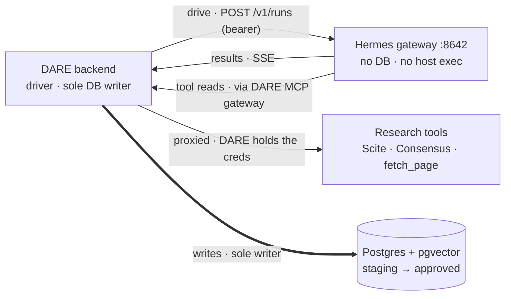
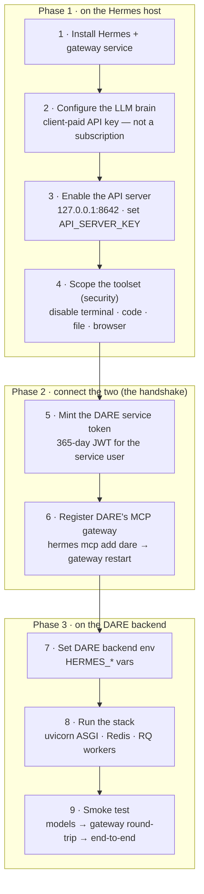
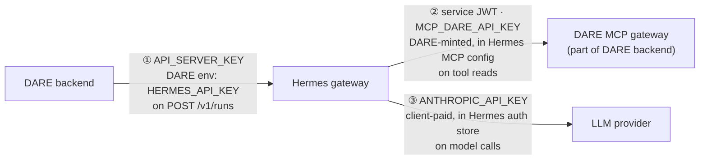

# Deploying Research Mode — the Hermes agent runtime

Research Mode delegates long-running research work (Scout / Critic / Presenter)
to **Hermes Agent** (Nous Research) over its REST API. This guide takes a server
from zero to a working Research Mode backend.

**The architecture invariant:** Hermes drives; DARE writes. Hermes never gets
database access — it returns structured results over its API, DARE persists
them, and the scholar gates everything durable.

```
DARE backend ── POST /v1/runs (bearer) ──▶ Hermes gateway (:8642)
     ▲                                          │
     │  persists (sole writer)                  │ MCP reads (tools)
     ▼                                          ▼
  Postgres ◀── staging → approved      DARE MCP gateway (/mcp/api/gateway/)
                                        Scite · Consensus · fetch_page
```

---

## Deployment at a glance (diagrams)

### The invariant — who drives, who writes, who reads



> Hermes drives the work but never touches the record. The only way Hermes
> reaches a tool is back through DARE's MCP gateway, so credentials and audit
> stay in DARE.

### The deployment sequence — three phases

Color/grouping = *where* the step happens. Phase 1 is all on the Hermes host,
phase 2 is the handshake, phase 3 is on the DARE backend.



### Credential wiring — three secrets, three directions

The most common deploy mistake: the same string is `API_SERVER_KEY` on the
Hermes side and `HERMES_API_KEY` on the DARE side — they must match. The service
JWT and the LLM key only ever flow *out of* Hermes.



| Secret | Lives in | Presented on | Purpose |
|---|---|---|---|
| `API_SERVER_KEY` (= DARE's `HERMES_API_KEY`) | Hermes `.env` | `POST /v1/runs` | DARE → Hermes (drive) |
| service JWT (`MCP_DARE_API_KEY`) | DARE-minted, stored in Hermes MCP config | gateway tool reads | Hermes → DARE (borrow tools) |
| `ANTHROPIC_API_KEY` | Hermes auth store | model calls | Hermes → LLM provider |

---

## 1. Install Hermes on the server

```bash
# Per Hermes docs (hermes-agent.nousresearch.com/docs) — uv-managed Python pkg
curl -fsSL https://hermes-agent.nousresearch.com/install.sh | sh
hermes setup            # non-interactive servers: see config.yaml below
```

Hermes home is `~/.hermes/`. The always-on piece is the **gateway service**
(`hermes gateway install && hermes gateway start`) which serves the REST API.

## 2. Configure the brain (the LLM)

Edit `~/.hermes/config.yaml`:

```yaml
model:
  default: <model-id>          # e.g. claude-sonnet-4-6
  provider: anthropic          # or another supported provider
agent:
  max_turns: 40                # loop cap — part of the cost containment
```

Add the credential (client-paid API key — **not** a consumer subscription;
Anthropic blocks subscription OAuth outside official clients):

```bash
hermes auth add anthropic --type api-key --api-key "$ANTHROPIC_API_KEY"
```

## 3. Enable the API server

In `~/.hermes/.env`:

```bash
API_SERVER_ENABLED=true
API_SERVER_KEY=<strong-random-key>        # DARE authenticates with this
MCP_DARE_API_KEY=<dare-service-token>     # Hermes→DARE gateway auth (step 5)
```

The API listens on `127.0.0.1:8642`. Keep it loopback-only (DARE and Hermes
co-located) or front it with TLS + network policy — the bearer key grants the
agent's full toolset.

## 4. Scope the toolset (security — do not skip)

The API platform must not expose host execution to a research agent:

```bash
hermes tools disable --platform api_server \
  terminal code_execution file browser delegation cronjob image_gen
```

Expected remaining set: `web`, `vision`, `skills`, `todo`, `memory`,
`session_search`.

## 5. Connect Hermes to DARE's MCP gateway

The gateway exposes the scholar's connected research tools (Scite, Consensus)
plus DARE's built-in fast `fetch_page` — credentials and audit stay in DARE.

```bash
hermes mcp add dare --url https://<dare-host>/mcp/api/gateway/ \
  --header "Authorization: Bearer ${MCP_DARE_API_KEY}"
```

Mint the service token (a long-lived JWT for the service user; a dedicated
service-key auth class is the planned replacement):

```bash
python manage.py shell -c "
from datetime import timedelta
from django.contrib.auth import get_user_model
from rest_framework_simplejwt.tokens import AccessToken
t = AccessToken.for_user(get_user_model().objects.get(email='<service-user>'))
t.set_exp(lifetime=timedelta(days=365))
print(t)"
```

> ⚠️ **After adding or changing gateway tools, run `hermes gateway restart`** —
> Hermes caches the MCP tool list per connection.

## 6. DARE backend settings

In the DARE environment:

```bash
HERMES_GATEWAY_URL=http://127.0.0.1:8642
HERMES_API_KEY=<API_SERVER_KEY from step 3>
HERMES_SYNC_SOUL=true                       # provision SOUL.md per run
HERMES_SOUL_PATH=/home/<user>/.hermes/SOUL.md
GEMINI_API_KEY=...                          # fetch_page fallback reader (optional)
```

Run the stack: ASGI server (`uvicorn dare.asgi:application`) + Redis +
**django-rq workers** (delegated runs execute on the `default` queue):

```bash
python manage.py rqworker default            # Linux
# macOS dev only: add --worker-class rq.SimpleWorker
```

## 7. Smoke test

```bash
# 1. Hermes up?
curl -s -H "Authorization: Bearer $API_SERVER_KEY" http://127.0.0.1:8642/v1/models

# 2. Gateway reachable from Hermes? (fetch_page round-trip through the agent)
curl -s -X POST http://127.0.0.1:8642/v1/runs \
  -H "Authorization: Bearer $API_SERVER_KEY" -H "Content-Type: application/json" \
  -d '{"input":"Call the mcp_dare_fetch_page tool on https://example.com and reply with the page title only.","session_id":"deploy-smoke"}'
# poll: curl .../v1/runs/<run_id>  → expect output "Example Domain"

# 3. End to end: POST /api/research/projects/<id>/scout/ with a JWT, poll
#    /api/research/agent-runs/<id>/, expect staged findings in the Review Inbox.
```

**Visual check (optional, but the friendliest way to get a feel).** The gateway
(`:8642`, JSON API) and the dashboard (`:9119`, web UI) are *separate processes* —
the dashboard isn't needed to run anything, but it's the easiest way to confirm
things by eye. Start it with `hermes dashboard` and open `http://127.0.0.1:9119`
to watch served models, live sessions, tool calls, and logs as your smoke-test
runs land; stop it with `hermes dashboard --stop`. On a headless server, tunnel
the port rather than exposing it.

## 8. Cost containment (already enforced in code — knobs for reference)

| Layer | Knob | Default |
|---|---|---|
| Hermes loop | `agent.max_turns` | 40 |
| DARE per run | `MAX_RUN_TOOL_CALLS` / `MAX_RUN_SECONDS` (`research/tasks.py`) | 18 / 480s |
| Scout depth | quick = 2 searches/3 reads · deep = 5 searches/10 reads | per request |
| Page reads | `MAX_CHARS` (`mcp/services/web_fetch.py`) | 40k chars |

Budget-exceeded runs are stopped via the Hermes stop endpoint and partial
results are salvaged into staging. Every run records token usage.

## 9. Multi-project memory (current state)

One Hermes instance serves all projects. Isolation today: per-project session
keys (`X-Hermes-Session-Key: dare-proj<id>`, Hermes's official scoping handle)
+ per-run sessions for delegated work. The agent's `MEMORY.md`/`USER.md` files
are instance-global (user-level in practice; bounded to ~2k chars by Hermes).
Planned upgrades, in order: memory-provider scoping (Honcho) keyed by session
key — per-project memory on one gateway; per-project gateway credentials for
hard tool scoping. **Per-project Hermes profiles are deliberately not used**
(one gateway process per project does not scale operationally).

## Known limitations (tracked for v1.1)

- Gateway exposes all of the service user's connected MCP servers; per-run
  scoping is prompt-level today, credential-level later.
- Structured output is prompt-contract + tolerant parsing + repair re-ask
  (Hermes's API has no native schema forcing yet; tracked upstream).
- `SOUL.md` file sync assumes runs from different projects don't overlap
  in the same instant; per-run `instructions` always carry the soul as fallback.
