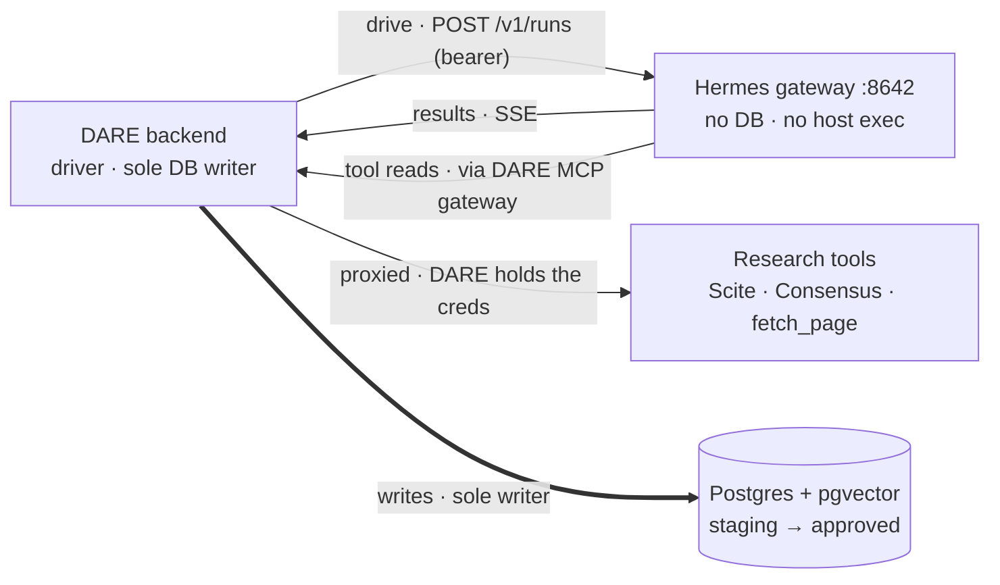
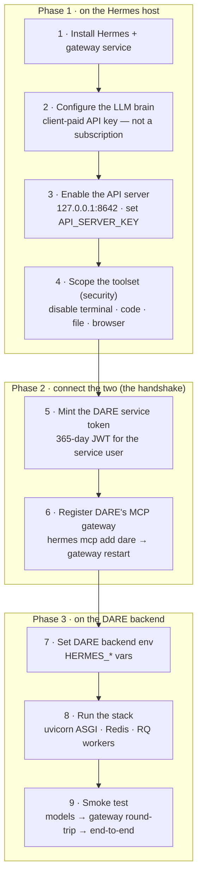
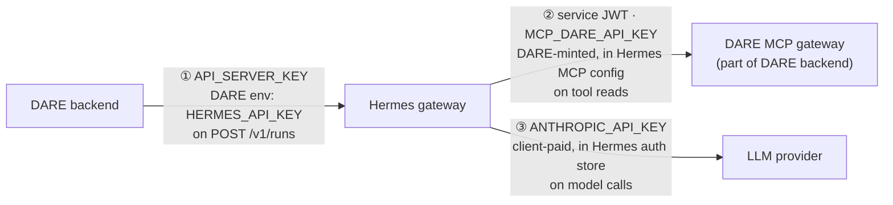

# Deploying Research Mode — the Hermes agent runtime

Research Mode delegates long-running research work (Scout / Critic / Presenter)
to **Hermes Agent** (Nous Research) over its REST API. This guide takes a server
from zero to a working Research Mode backend.

**The architecture invariant:** Hermes drives; DARE writes. Hermes never gets
database access — it returns structured results over its API, DARE persists
them, and the scholar gates everything durable.

```
DARE backend ── POST /v1/runs (bearer) ──▶ Hermes gateway (:8642)
     ▲                                          │
     │  persists (sole writer)                  │ MCP reads (tools)
     ▼                                          ▼
  Postgres ◀── staging → approved      DARE MCP gateway (/mcp/api/gateway/)
                                        Scite · Consensus · fetch_page
```

---

## Deployment at a glance (diagrams)

### The invariant — who drives, who writes, who reads


```mermaid
flowchart LR
  DARE["DARE backend<br/>driver · sole DB writer"]
  HERMES["Hermes gateway :8642<br/>no DB · no host exec"]
  DB[("Postgres + pgvector<br/>staging → approved")]
  TOOLS["Research tools<br/>Scite · Consensus · fetch_page"]

  DARE -->|"drive · POST /v1/runs (bearer)"| HERMES
  HERMES -->|"results · SSE"| DARE
  HERMES -->|"tool reads · via DARE MCP gateway"| DARE
  DARE -->|"proxied · DARE holds the creds"| TOOLS
  DARE ==>|"writes · sole writer"| DB
```

> Hermes drives the work but never touches the record. The only way Hermes
> reaches a tool is back through DARE's MCP gateway, so credentials and audit
> stay in DARE.

### The deployment sequence — three phases

Color/grouping = *where* the step happens. Phase 1 is all on the Hermes host,
phase 2 is the handshake, phase 3 is on the DARE backend.


```mermaid
flowchart TB
  subgraph P1["Phase 1 · on the Hermes host"]
    direction TB
    S1["1 · Install Hermes + gateway service"]
    S2["2 · Configure the LLM brain<br/>client-paid API key — not a subscription"]
    S3["3 · Enable the API server<br/>127.0.0.1:8642 · set API_SERVER_KEY"]
    S4["4 · Scope the toolset (security)<br/>disable terminal · code · file · browser"]
    S1 --> S2 --> S3 --> S4
  end
  subgraph P2["Phase 2 · connect the two (the handshake)"]
    direction TB
    S5["5 · Mint the DARE service token<br/>365-day JWT for the service user"]
    S6["6 · Register DARE's MCP gateway<br/>hermes mcp add dare → gateway restart"]
    S5 --> S6
  end
  subgraph P3["Phase 3 · on the DARE backend"]
    direction TB
    S7["7 · Set DARE backend env<br/>HERMES_* vars"]
    S8["8 · Run the stack<br/>uvicorn ASGI · Redis · RQ workers"]
    S9["9 · Smoke test<br/>models → gateway round-trip → end-to-end"]
    S7 --> S8 --> S9
  end
  S4 --> S5
  S6 --> S7
```

### Credential wiring — three secrets, three directions

The most common deploy mistake: the same string is `API_SERVER_KEY` on the
Hermes side and `HERMES_API_KEY` on the DARE side — they must match. The service
JWT and the LLM key only ever flow *out of* Hermes.


```mermaid
flowchart LR
  DARE["DARE backend"]
  HERMES["Hermes gateway"]
  GW["DARE MCP gateway<br/>(part of DARE backend)"]
  LLM["LLM provider"]

  DARE -->|"① API_SERVER_KEY<br/>DARE env: HERMES_API_KEY<br/>on POST /v1/runs"| HERMES
  HERMES -->|"② service JWT · MCP_DARE_API_KEY<br/>DARE-minted, in Hermes MCP config<br/>on tool reads"| GW
  HERMES -->|"③ ANTHROPIC_API_KEY<br/>client-paid, in Hermes auth store<br/>on model calls"| LLM
```

| Secret | Lives in | Presented on | Purpose |
|---|---|---|---|
| `API_SERVER_KEY` (= DARE's `HERMES_API_KEY`) | Hermes `.env` | `POST /v1/runs` | DARE → Hermes (drive) |
| service JWT (`MCP_DARE_API_KEY`) | DARE-minted, stored in Hermes MCP config | gateway tool reads | Hermes → DARE (borrow tools) |
| `ANTHROPIC_API_KEY` | Hermes auth store | model calls | Hermes → LLM provider |

---

## 1. Install Hermes on the server

```bash
# Per Hermes docs (hermes-agent.nousresearch.com/docs) — uv-managed Python pkg
curl -fsSL https://hermes-agent.nousresearch.com/install.sh | sh
hermes setup            # non-interactive servers: see config.yaml below
```

Hermes home is `~/.hermes/`. The always-on piece is the **gateway service**
(`hermes gateway install && hermes gateway start`) which serves the REST API.

## 2. Configure the brain (the LLM)

Edit `~/.hermes/config.yaml`:

```yaml
model:
  default: <model-id>          # e.g. claude-sonnet-5
  provider: anthropic          # or another supported provider
agent:
  max_turns: 40                # loop cap — part of the cost containment
  reasoning_effort: ''         # see note below (required for Sonnet 5 and newer)
```

> ⚠️ **Sonnet 5 / newer models + extended thinking.** With `reasoning_effort`
> set (its default is `medium`), this Hermes build sends the legacy
> `thinking.type.enabled` request field, which Sonnet 5 rejects with
> `HTTP 400 "thinking.type.enabled is not supported for this model"` — the run
> fails before its first turn. Set `agent.reasoning_effort: ''` to disable
> extended thinking until Hermes adopts the adaptive-thinking API
> (`thinking.type.adaptive` + `output_config.effort`).

Add the credential (client-paid API key — **not** a consumer subscription;
Anthropic blocks subscription OAuth outside official clients):

```bash
hermes auth add anthropic --type api-key --api-key "$ANTHROPIC_API_KEY"
```

## 3. Enable the API server

In `~/.hermes/.env`:

```bash
API_SERVER_ENABLED=true
API_SERVER_KEY=<strong-random-key>        # DARE authenticates with this
MCP_DARE_API_KEY=<dare-service-token>     # Hermes→DARE gateway auth (step 5)
```

The API listens on `127.0.0.1:8642`. Keep it loopback-only (DARE and Hermes
co-located) or front it with TLS + network policy — the bearer key grants the
agent's full toolset.

`API_SERVER_KEY` must be at least 16 characters. Hermes v0.19 rejects a shorter
one and the gateway then refuses to bind, which presents as a gateway that
starts and immediately exits.

## 3.1 Enable multiplex profiles (required)

Each research project gets its own Hermes profile, and a profile is nothing but
its own `HERMES_HOME` directory — `SOUL.md`, `memories/MEMORY.md`,
`memories/USER.md`, sessions and `.env` all resolve from that root. That is what
makes one project's agent memory private to it by construction rather than by a
naming convention.

Multiplex mode is what keeps this cheap: one gateway process serves every
profile from the single listener under `/p/<profile>/`, so N projects still
means one process and one port.

In `~/.hermes/config.yaml`:

```yaml
gateway:
  multiplex_profiles: true
```

Restart the gateway, then confirm routing. A known profile answers and an
unknown one is refused rather than silently falling back to the default:

```bash
curl -s -o /dev/null -w '%{http_code}\n' \
  -H "Authorization: Bearer $API_SERVER_KEY" \
  http://127.0.0.1:8642/p/dare-proj1/v1/models          # 200 once project 1 exists
curl -s -o /dev/null -w '%{http_code}\n' \
  -H "Authorization: Bearer $API_SERVER_KEY" \
  http://127.0.0.1:8642/p/not-a-real-profile/v1/models  # 404
```

DARE provisions each profile lazily on first use — directory, `config.yaml`,
and an owner-scoped token — so there is nothing to create by hand. Deleting a
profile directory is safe; it is rebuilt on the project's next run, minus
whatever the agent had remembered.

If `multiplex_profiles` is off, every project falls back to the shared default
profile and the isolation described here does not apply. Set
`HERMES_PROFILE_PER_PROJECT=False` on the DARE side to make that fallback
deliberate rather than accidental.

## 4. Scope the toolset (security — do not skip)

The API platform must not expose host execution to a research agent:

```bash
hermes tools disable --platform api_server \
  terminal code_execution file browser delegation cronjob image_gen
```

Expected remaining set: `web`, `vision`, `skills`, `todo`, `memory`,
`session_search`.

## 5. Connect Hermes to DARE's MCP gateway

The live gateway exposes only DARE-owned, credential-free builtins —
`web_search` and `fetch_page`. The scholar's **credentialed** tools (Scite,
Consensus) are deliberately **not** exposed here: Hermes forwards no per-user
identity, so DARE runs those server-side under the project owner and injects
their results into the run input. Credentials and audit stay in DARE.

```bash
hermes mcp add dare --url https://<dare-host>/mcp/api/gateway/ \
  --header "Authorization: Bearer ${MCP_DARE_API_KEY}"
```

Then pin the tool allowlist in `~/.hermes/config.yaml` so the agent is offered
exactly the two working builtins:

```yaml
mcp_servers:
  dare:
    url: https://<dare-host>/mcp/api/gateway/
    headers:
      Authorization: Bearer ${MCP_DARE_API_KEY}
    tools:
      include:
        - web_search
        - fetch_page
    enabled: true
```

> ⚠️ **Both entries matter.** A missing `web_search` silently forces the agent
> to *guess* article URLs instead of searching (→ hallucinated DOIs, mass fetch
> failures). And do **not** list credentialed tools like `consensus__search` —
> the live gateway refuses them, so every such call just wastes a turn.

Mint the service token (a long-lived JWT for the service user; a dedicated
service-key auth class is the planned replacement):

```bash
python manage.py shell -c "
from datetime import timedelta
from django.contrib.auth import get_user_model
from rest_framework_simplejwt.tokens import AccessToken
t = AccessToken.for_user(get_user_model().objects.get(email='<service-user>'))
t.set_exp(lifetime=timedelta(days=365))
print(t)"
```

> ⚠️ **After adding or changing gateway tools, run `hermes gateway restart`** —
> Hermes caches the MCP tool list per connection.

### 5.1 Audit attribution — do not patch Hermes in production

DARE talks to Hermes over **two channels**: the per-run SSE **control stream**
(`tool.completed` events — names + timing, no result body) and the shared **MCP
gateway** (where DARE runs `fetch_page`/`web_search` and stores the full result
in `GatewayFetch` — but with no run id). To show *which* result belongs to
*which* streamed call, the audit needs a shared key on both sides.

DARE (this repo) already carries its half: it reads a per-call id from MCP
`_meta` and stores it as `GatewayFetch.call_id`, and joins the stream event to
the corpus row on that id. When the upstream end-to-end correlation metadata is
absent, DARE falls back to an in-order/time-window match. That fallback keeps
the audit usable but can blank or mis-attribute rows for re-fetched URLs or
concurrent runs; treat this as a known observability limitation, not a reason to
patch Hermes in production.

The patch recipe below is retained only to explain older local installations.
**Do not apply it to a deployed Hermes package.** Newer upstream releases
already expose `toolCallId` in API streaming events; the DARE-specific MCP
`_meta.dareCall` forwarding is not an upstream contract. Production must pin a
clean upstream Hermes release and use the fallback correlation above until a
generic end-to-end metadata contract is released upstream.

**What that costs you, concretely.** The exact join needs a shared id on both
sides. v0.19 supplies the stream half on its own — `tool.completed` carries
`toolCallId` (verified: `toolu_…`). The gateway half, `GatewayFetch.call_id`,
only gets set when Hermes forwards that id through MCP `_meta`, which is what
the patch does. So an unpatched production Hermes matches by order and time
window instead of by id, which is fine for a quiet single run and unreliable for
concurrent runs or a re-fetched URL.

You will not have to guess which one you are getting. DARE logs a warning
whenever a gateway tool call produces no row, and a separate one when the
runtime named a `toolCallId` that did not match — grep `research.audit` in the
worker logs. Silence means every call joined exactly.

A patched local install is kept at `ops/hermes/0001-dare-toolcall-correlation.patch`
and still applies cleanly to v0.19.

Historical local patch recipe (diagnostic reference only):

1. **`tools/mcp_tool.py`** — send the id on the MCP call (in the `_call()`
   coroutine that wraps `session.call_tool`):
   ```python
   from tools.approval import _approval_tool_call_id
   _cid = _approval_tool_call_id.get("")
   result = await server.session.call_tool(
       tool_name, arguments=args, meta=({"dareCall": _cid} if _cid else None)
   )
   ```
2. **`agent/tool_executor.py`** — pass the id on **both** `tool.completed`
   progress-callback sites (the sequential path and the parallel path — the
   parallel one is the MCP dispatch and is easy to miss):
   ```python
   agent.tool_progress_callback(
       "tool.completed", function_name, None, None,
       duration=..., is_error=..., result=...,
       tool_call_id=getattr(tc, "id", "") or "",          # sequential path
       # tool_call_id=getattr(tool_call, "id", "") or "",  # parallel path var
   )
   ```
3. **`gateway/platforms/api_server.py`** — put it on the streamed event:
   ```python
   elif event_type == "tool.completed":
       _push({..., "error": kwargs.get("is_error", False),
              "toolCallId": kwargs.get("tool_call_id", "")})
   ```

Older patched installations required a gateway restart and were verified by
matching `GatewayFetch.call_id` to the streamed `toolCallId`. Do not reproduce
that deployment pattern; use it only when diagnosing and removing an existing
local patch.

## 6. DARE backend settings

In the DARE environment:

```bash
HERMES_GATEWAY_URL=http://127.0.0.1:8642
HERMES_API_KEY=<API_SERVER_KEY from step 3>
HERMES_SYNC_SOUL=true                       # provision SOUL.md per run
HERMES_SOUL_PATH=/home/<user>/.hermes/SOUL.md
GEMINI_API_KEY=...                          # fetch_page fallback reader (optional)
```

Per-project profiles (see §3.1). Every one of these has a working default —
set them only to move off it:

```bash
HERMES_PROFILE_PER_PROJECT=True             # False => shared default profile
HERMES_PROFILES_ROOT=/home/<user>/.hermes/profiles
HERMES_PROFILE_PREFIX=dare-proj             # profile name = <prefix><project id>
HERMES_PROFILE_MODEL=claude-sonnet-5        # pinned into every project profile
HERMES_PROFILE_MODEL_PROVIDER=anthropic
HERMES_PROFILE_TOKEN_DAYS=365               # owner-scoped MCP token lifetime
HERMES_STREAM_IDLE_SECONDS=180              # idle bound on a run's event stream
DARE_MCP_GATEWAY_URL=http://127.0.0.1:8000/mcp/api/gateway/
```

Two of these are load-bearing and worth reading twice.

**Never set `HERMES_PROFILE_MODEL_PROVIDER` with an empty
`HERMES_PROFILE_MODEL`.** With a provider named and no model, Hermes falls
through to entry `[0]` of that provider's curated list — for `anthropic` that is
the flagship. It guards metered aggregators against this but not the direct
providers, so a blank model bills the priciest model on every run, silently.
DARE raises `ImproperlyConfigured` at provisioning time rather than let that
ship, but the safe way to inherit is to name no provider at all.

**`DARE_MCP_GATEWAY_URL` is resolved by the machine running Hermes,** not by the
browser. It is written into each profile's `config.yaml`, so it must be reachable
from the gateway host — `127.0.0.1` is right when Hermes and DARE are co-located,
and wrong the moment they are not.

Apply migrations first — the audit-attribution work adds
`GatewayFetch.run_key` and `.call_id` (see §5.1):

```bash
python manage.py migrate
```

Run the stack: ASGI server (`uvicorn dare.asgi:application --workers N`) + Redis
+ **django-rq workers** (delegated runs execute on the `default` queue):

```bash
python manage.py rqworker default            # Linux
# macOS dev only: add --worker-class rq.SimpleWorker
```

> ⚠️ **Redis is required as the shared cache, not just for RQ/Channels.** The
> ASGI server runs multiple worker processes; the Django default `LocMemCache`
> is per-process, so anything cached on one request (MCP OAuth PKCE state,
> session data) is invisible to the next request on another worker. `CACHES` in
> `config/settings/common.py` is a `RedisCache` reusing the same `REDIS_*` env
> as Channels/RQ — point them all at one Redis instance. (Because that Redis DB
> is shared, never call `cache.clear()` — it FLUSHDBs the whole DB.)

## 7. Smoke test

```bash
# 1. Hermes up?
curl -s -H "Authorization: Bearer $API_SERVER_KEY" http://127.0.0.1:8642/v1/models

# 2. Gateway reachable from Hermes? (fetch_page round-trip through the agent)
curl -s -X POST http://127.0.0.1:8642/v1/runs \
  -H "Authorization: Bearer $API_SERVER_KEY" -H "Content-Type: application/json" \
  -d '{"input":"Call the mcp_dare_fetch_page tool on https://example.com and reply with the page title only.","session_id":"deploy-smoke"}'
# poll: curl .../v1/runs/<run_id>  → expect output "Example Domain"

# 3. End to end: POST /api/research/projects/<id>/scout/ with a JWT, poll
#    /api/research/agent-runs/<id>/, expect staged findings in the Review Inbox.
```

**Visual check (optional, but the friendliest way to get a feel).** The gateway
(`:8642`, JSON API) and the dashboard (`:9119`, web UI) are *separate processes* —
the dashboard isn't needed to run anything, but it's the easiest way to confirm
things by eye. Start it with `hermes dashboard` and open `http://127.0.0.1:9119`
to watch served models, live sessions, tool calls, and logs as your smoke-test
runs land; stop it with `hermes dashboard --stop`. On a headless server, tunnel
the port rather than exposing it.

## 8. Cost containment (already enforced in code — knobs for reference)

| Layer | Knob | Default |
|---|---|---|
| Hermes loop | `agent.max_turns` | 40 |
| Scout depth | quick = 2 searches/3 reads · deep = 5 searches/10 reads | per request |
| Page reads | `MAX_CHARS` (`mcp/services/web_fetch.py`) | 40k chars |

Hermes owns the execution-loop ceiling. DARE does not independently count
streamed tool events, impose an eight-minute execution deadline, or start a
second synthesis run after cancelling the first. The Hermes stop endpoint is
reserved for explicit cancellation. Every completed run records the usage
reported by Hermes.

Page failures are honest, not fatal: a paywalled / blocked / 404 page is
returned to the agent as a normal "couldn't read this one" result (its real
HTTP reason — 403, 404, 429 — probed and reported, not guessed), **without** an
`isError` flag, so a run of dead links no longer trips Hermes's per-server
circuit breaker and kills the run.

## 9. Multi-project memory

One Hermes process serves all projects, but each project gets its own profile
directory (§3.1). The three files in it have three different owners and three
different reaches — that distinction is the design, not an implementation
detail:

| File | Written by | Reaches |
|---|---|---|
| `SOUL.md` | DARE, versioned | this project |
| `memories/MEMORY.md` | the agent, as it works | this project only |
| `memories/USER.md` | the agent; DARE absorbs and re-renders | every project this scholar owns |

`USER.md` is about the person rather than the project, so DARE folds it into a
`ResearcherProfile` record and renders it into every profile that scholar owns.
Teach one project your name and every project knows it, while the projects' own
facts stay apart.

Anything the agent writes to `MEMORY.md` is raised as a proposal the scholar
accepts or rejects. Accepting copies it into `ResearchProjectMemory`, which DARE
owns and injects into later runs; rejecting removes it from `MEMORY.md`, so the
agent stops acting on a fact that was turned down.

Hermes caps these files (`memory.memory_char_limit`, default 2200;
`memory.user_char_limit`, default 1375) and **rejects** an entry that would
exceed the cap rather than truncating — the agent is told to shorten or remove
first. Rejecting proposals is the release valve.

An external memory provider (Honcho, mem0, and the rest of
`plugins/memory/`) is deliberately **not** used. Those providers ingest each
turn automatically, which leaves nothing discrete to review and no derivation to
inspect — the opposite of the gate above. `memory.provider` should stay empty.

Verify all of this with `python ops/hermes/verify_multiplex.py`, which exits
non-zero on failure and covers profile routing, model pinning, cross-profile
recall, and tool scoping.

## Known limitations (tracked for v1.1)

- Gateway exposes all of the service user's connected MCP servers; per-run
  scoping is prompt-level today, credential-level later.
- Structured output is prompt-contract + tolerant parsing. Automatic repair
  re-asks are disabled until child execution attempts have durable identity,
  usage aggregation, and fencing (Hermes has no native schema forcing yet).
- `SOUL.md` sync is no longer a shared-file race — each project writes its own
  profile's copy (§3.1) — but per-run `instructions` still carry the soul as a
  fallback for the unprofiled path.
- `USER.md` propagation is a write, not a lookup: if rendering into one sibling
  profile fails, that profile keeps a stale copy and only a log line says so.
  A reconciliation pass is not built yet.
