# Docling and document graph: product and reliability brief

Date: 2026-09-04. Branch: `farhat/fix/docling-reference-quality`.
Verification target: the final feature-branch head. Record the merge commit and
index state with the controlled evaluation results.

## Executive position

DARE should keep structure-aware chunking as the document default. The document
body remains intact, small sections receive retrieval-only context, and files
without usable structure still fall back to flat chunking. Internal-reference
resolution can be called complete as a product capability: DARE stores and
resolves in-document pointers and may follow one target hop during Advanced RAG.
That does not mean a general knowledge graph or full Graph RAG is complete.

The defensible quality statement is:

> Structure-aware retrieval now preserves the basic evidence available to flat
> retrieval while adding page, section, table, figure, and reference context.
> Focused tests and live corpus checks show no basic factual regression. A
> permanent controlled flat-versus-structured benchmark is still required before
> claiming a universal percentage improvement.

## What Docling contributes

Docling is DARE's document-understanding layer, not the answer model and not the
vector database. It turns an uploaded file into reading-order elements with type
and location: headings, paragraphs, tables, pictures, captions, pages, bounding
boxes, and heading ancestry.

That structure enables DARE to:

- preserve tables and figures as meaningful units;
- give every chunk a page and section;
- describe a figure with its caption and surrounding section;
- identify scanned pages that need approved vision transcription;
- expose the Structure and Map views;
- resolve pointers such as `Figure 1.6` or `Section 2.1`;
- retrieve a small section with enough neighbouring context to rank reliably.

## End-to-end flow

```mermaid
flowchart LR
    Upload["User uploads a document"] --> Parse["Docling parses structure and reading order"]
    Parse --> Safety["Native PDF text checks for content Docling missed"]
    Parse --> Vision{"Pictures or scanned pages?"}
    Vision -->|"Figures"| Describe["Vision describes useful figures with local context"]
    Vision -->|"Scanned pages"| Approval["User reviews model, page count, and estimated cost"]
    Approval --> Transcribe["Approved pages are transcribed and saved"]
    Vision -->|"No"| Compose["Compose structured text plus only missing native text"]
    Describe --> Compose
    Transcribe --> Compose
    Compose --> Chunk["Create exact chunks with page and section metadata"]
    Chunk --> Context["Create separate retrieval context for small chunks"]
    Chunk --> Map["Store chunks, entities, and internal pointers in Postgres"]
    Context --> Vector["Embed retrieval context; store exact body separately"]
    Vector --> Search["Hybrid keyword and vector retrieval"]
    Map --> Expand["Optionally follow one relevant pointer or shared entity"]
    Search --> Rerank["Rerank direct hits and expanded candidates"]
    Expand --> Rerank
    Rerank --> Answer["Assemble exact source bodies with page, section, and S-number citations"]
```

## What is stored

| Store | Purpose |
|---|---|
| `File.extracted_text` | Complete, composed full-document text used when the whole file is attached. |
| `File.document_model.elements` | Bounded frontend preview of the structure. Text may be shortened for display only. |
| `File.document_model.chunk_elements` | Every complete parser element used for re-indexing. Never the shortened preview. |
| `DocumentChunk` | Exact chunk body, page range, section, heading path, and element range for the Map. |
| `DocumentReference` | Stored in-document pointer from one chunk to a resolved target chunk, or an explicit unresolved result. |
| `DocumentEntity` | Entity labels found in chunks. Cross-document connections are derived from shared labels at query time. |
| Weaviate `content` | Heading-aware and neighbour-aware retrieval representation used by dense search, BM25, and reranking. |
| Weaviate `body_text` | Exact source passage returned to the answer model and shown as the citation. |

There is no Neo4j and no permanent cross-document edge. The stored graph is the
in-document `DocumentReference` relationship. Shared-entity hops across selected
documents are computed at query time.

## Bugs encountered and their disposition

| Problem | User-visible risk | Current disposition |
|---|---|---|
| A 400-character structure preview was reused for chunking | A sentence after character 400 could disappear | Fixed: re-indexing requires the complete `chunk_elements` representation; legacy truncated models are reparsed once. |
| Docling omitted a sentence that native extraction retained | Basic factual retrieval could regress | Fixed: native text is an independent recovery lane and genuinely missing blocks become searchable. |
| Native PDF text replaced Docling's composed text | Full-file prompts could flatten tables | Fixed: Docling remains primary; native text only appends missing content. Verified on file 49 with all 294 table pipes retained and `11/26` present. |
| Small chunks borrowed an identical sorted neighbourhood | Near-identical vectors could occupy several result slots | Fixed at the source: each chunk's exact body now leads its retrieval representation, followed by neighbours. File 47 rebuild: 21 duplicate members before, zero exact duplicates after. |
| Heading paths appeared inside the quoted chunk | Citations showed retrieval scaffolding as source text | Fixed: `content` and `body_text` are separate in Weaviate and the reranker/citation paths use the correct representation. |
| A failed reranker left graph hops with inherited vector scores | An irrelevant hop could evict stronger direct evidence | Fixed: without real reranker scores, a hop uses only a spare slot unless the question explicitly names the pointer. |
| Generated `Page N` transcription headers were parsed as references | DARE created false internal links itself | Fixed: page location is metadata and is no longer injected into transcription content. |
| Blank raster pages received plausible vision prose | Hallucinated text could become searchable evidence | Fixed: blank pages are detected locally, skip the provider, and produce no chunk. Stored false results are invalidated on reprocess. |
| Chapter text lacked visible numbers | Real `Chapter N` pointers stayed unresolved | Fixed where the PDF supplies trustworthy bookmarks: native outline entries are conservative fallback anchors. A document with neither numbered headings nor bookmarks remains unresolved by design. |
| Oversized tables exceeded the embedding budget | One table could become an enormous vector input | Fixed: tables split within the same budget and repeat their header. |
| OCR continuation risked losing earlier pages | Reprocessing could erase paid transcription work | Fixed: completed pages and parser elements are persisted and reused; only unfinished approved pages are sent. |
| Weaviate was unavailable | Processing failed without a useful product explanation | The ingestion journey identifies vector indexing as the failed stage and retains the failure for retry/diagnosis. |

## Reliability evidence on this revision

- Backend suite: 709 tests, zero failures.
- Migration check: no model changes detected.
- Changed Python files pass the project's Black formatting check, and the diff
  has no whitespace errors.
- File 49 read-only parse: 17 pages, five tables, 294 Docling table pipes
  retained, `Instructor: Doug Coulson` present, and native-only `11/26` present.
- File 47 in-memory rebuild: 918 chunks and zero exact duplicate retrieval
  representations, compared with 21 duplicate members in the old live index.
- Six live Advanced RAG checks all returned the intended evidence and passed the
  current grounding threshold:
  - office hours: 0.662;
  - Super Bowl MVP milestone: 0.800;
  - Python method-resolution algorithm: 0.998;
  - Al Capone overview: 0.896;
  - 2004 versus 2011 tsunami comparison: 0.577;
  - multiple-inheritance problems and solutions: 0.840.

These are smoke and regression checks, not a controlled flat-versus-structured
benchmark.

## Honest limitations

1. Docling can misclassify headings or table cells. The Map makes this visible,
   but DARE cannot guarantee that every parser interpretation is correct.
2. Native recovery can add a correct fact alongside an incorrect Docling cell;
   it cannot safely delete the parser's version without another source of truth.
3. Native-only recovery blocks are appended after Docling's composed text because
   their exact reading-order position cannot be inferred safely. They remain
   searchable but may appear after the main document in full-file context.
4. References resolve only when the document exposes an anchor through headings,
   captions, pages, or PDF bookmarks.
5. Entity spelling and aliases remain heuristic. Stable identifiers are safer
   than person-name variants for cross-document hops.
6. Vector replacement is scoped correctly but is not atomic; a mid-upsert crash
   leaves the file failed and requires retry.
7. Existing files keep their old embeddings until explicitly re-indexed. Code
   fixes that change retrieval representation apply automatically to new uploads.
8. The 0.3 grounding threshold passed the current live checks, but must remain in
   the permanent evaluation because contextual reranker inputs changed its score
   distribution.
9. No universal retrieval-quality percentage should be quoted until the frozen
   evaluation questions, expected answers, source pages, runner settings, raw
   outputs, commit, and index state are saved together.

## Recommended rollout

1. Merge behind the existing Advanced RAG controls and use structure-aware
   chunking as the default for new document uploads.
2. Keep flat chunking as the automatic fallback for formats without trustworthy
   elements; do not ask ordinary users to choose a chunking algorithm.
3. Re-index a controlled testing corpus, then run the frozen evaluation before
   production promotion.
4. Monitor grounding warnings, unresolved-reference rate, duplicate candidate
   rate, parser failures, and indexing retries.
5. Keep full Graph RAG, entity aliasing, and multi-hop reasoning as later work.

## Suggested meeting language

**What did Docling add?**

> Previously we mostly had text. Now we understand the document: what is a
> heading, paragraph, table, figure, caption, and page, and how those pieces are
> nested. That makes visual enrichment, chunking, citations, OCR approval, and
> internal-reference resolution possible.

**Is internal referencing complete?**

> The scoped capability is complete: we detect, store, resolve, display, and
> safely follow one in-document reference. That closes the missing internal-link
> item from the Advanced RAG checklist. It is not a claim that we have built a
> general multi-hop knowledge graph.

**Is it better than flat chunking?**

> It preserves more document structure, and our regression evidence says basic factual retrieval
> remains safe. It has clear advantages for tables, figures, section-specific
> questions, provenance, and author-written references. We are not presenting a
> universal improvement percentage; the controlled A/B evaluation is
> the final rollout gate.

**Why not expose flat versus structured in the upload UI?**

> Chunking is an implementation detail. DARE should choose the strongest safe
> representation automatically and fall back when structure is unavailable. A
> user-facing algorithm picker adds confusion without improving the document.

**What would stop production rollout?**

> A reproducible evaluation showing factual regression, unexpected grounding
> warnings, or unstable indexing. The known content-loss and graph-hop failure
> modes now have explicit regression tests.
