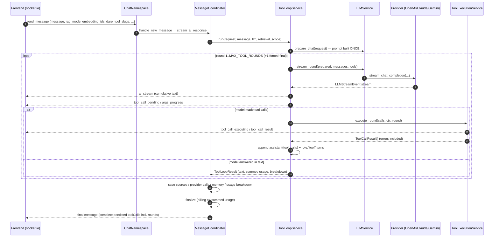
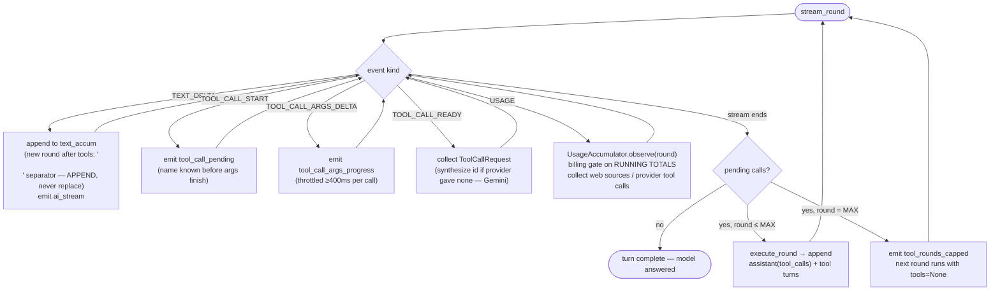
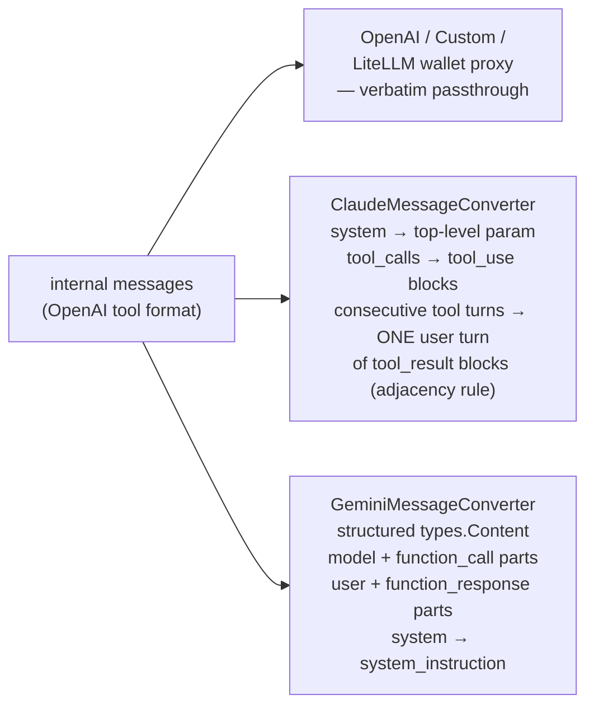
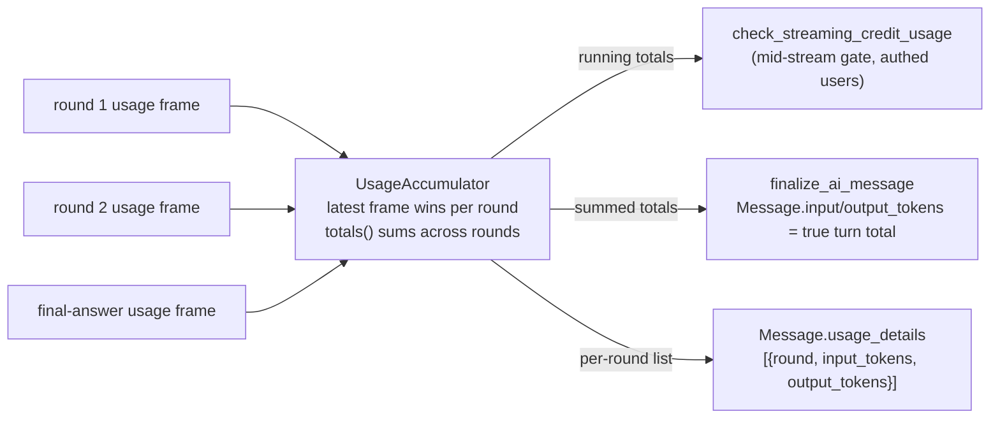

# The Tool Loop — Chat Tool-Calling Architecture (2026)

> **Companion to** [`advanced-rag-implementation.md`](./advanced-rag-implementation.md) (Track A) and the agentic RAG work (Track B). This doc explains how a chat message flows from the socket to the LLM and back when tools are involved: the **bounded multi-round tool loop**, the **provider-native tool-turn message schema**, the **unified frontend event protocol**, and **cross-round billing**. Read this before touching anything in the `socket → coordinator → loop → provider` path.

---

## 0. TL;DR

- A chat turn is a **loop**, not a pipeline: the model streams, calls tools, sees the results as native `role:"tool"` turns, and streams again — up to `MAX_TOOL_ROUNDS` (5), after which one final call runs with tools stripped, forcing a text answer. Termination is guaranteed.
- The model can **chain tools across rounds** (search → search again, search → chart). Failures come back as error turns the model can read and react to — a failed call never kills the turn.
- The internal message schema is **OpenAI's tool format everywhere**; Claude and Gemini get translated at the provider edge by dedicated converters. The LiteLLM wallet proxy consumes the internal format directly for every provider.
- The frontend gets **one event vocabulary** for every tool origin (DARE / MCP / provider-native), including a "the model is writing a tool call" signal with live argument-size progress — the longest previously-silent window in the product.
- **Billing sums across rounds.** Each model call's tokens accumulate; `Message.input_tokens/output_tokens` hold the true turn total and `Message.usage_details` keeps the per-round breakdown.
- Retrieval scope for agentic RAG (`search_documents`) comes from the request DTO, never from model arguments — the model chooses *when* to search, not *what* it may see.

---

## 1. The flow, end to end



Key invariant: **the prompt is built exactly once per turn** (`LLMService.prepare_chat`). Rounds append tool turns to the round-1 message list and re-stream. That is what guarantees RAG pre-injection, snippet persistence, and the retrieval trace each run once — the old flow rebuilt the prompt for its synthesis call and re-ran retrieval against the tool-result blob, clobbering the turn's citations.

---

## 2. The round lifecycle



Failure semantics: `ToolExecutionService` **never raises**. A failed call becomes a `ToolCallResult` whose content is `"Error: …"` — persisted, emitted to the FE as `status:"failed"`, and appended as a `role:"tool"` turn so the model can acknowledge or retry in the next round.

---

## 3. Internal message schema (OpenAI format) & provider converters

Tool turns live in the message list in OpenAI's shape, built by `core/services/llm_helpers/tool_turn_helpers.py`:

```jsonc
// assistant turn announcing calls (this round's streamed text rides along)
{"role": "assistant", "content": "Let me search.", "tool_calls": [
    {"id": "call_abc", "type": "function",
     "function": {"name": "search_documents", "arguments": "{\"query\": \"...\"}"}}]}

// one result turn per call, in order
{"role": "tool", "tool_call_id": "call_abc", "name": "search_documents",
 "content": "Retrieved 4 passages ... [S1] ..."}
```



Two provider gotchas encoded in the converters (`core/services/llm_utils/provider_message_converters.py`):

1. **Claude adjacency** — every `tool_use` id must be answered by a `tool_result` in the *immediately following* user turn, including failures and the cap path. The converter groups consecutive `role:"tool"` turns into one user turn to satisfy this.
2. **Gemini `FunctionCallingConfig` is `AUTO`, never `ANY`** — `ANY` forces a function call on *every* request, which inside a loop means the model can never produce a final text answer (it would spin until the round cap on every message).

History replays the same way: `core/services/llm_helpers/history_helpers.py` reconstructs structured tool turns from persisted `MessageToolCall` rows (grouped by `round_index`), full-fidelity for the most recent `TOOL_HISTORY_MESSAGE_WINDOW` (6) assistant messages, compressed to a one-line `[used tools: …]` note beyond that.

---

## 4. The streaming layer: `LLMStreamEvent`

Every provider SDK stream is normalized into typed events by `core/services/llm_utils/stream_processors.py`:

| kind | when | payload |
|---|---|---|
| `TEXT_DELTA` | text token arrives | `text` |
| `TOOL_CALL_START` | provider reveals a call's name | `tool_call_id`, `tool_name` |
| `TOOL_CALL_ARGS_DELTA` | argument JSON grows | `args_delta`, `args_len` (cumulative) |
| `TOOL_CALL_READY` | arguments complete | `tool_call: ToolCallRequest` |
| `USAGE` | token/metadata frame | `usage` dict (tokens, cost, web sources, provider tool calls, …) |

How early each provider reveals a call:

- **Claude**: name + id at `content_block_start` — before any arguments stream. Earliest signal.
- **OpenAI**: first delta carrying `function.name`; `READY` at `finish_reason == "tool_calls"`.
- **Gemini**: calls arrive whole — `START` + `READY` back-to-back; ids are synthesized by the loop (`tc-<msg>-r<round>-<n>`).

`LLMService.query()` still exists for single-shot consumers (workflows, summaries, learning progress) — it downgrades events to the legacy `(chunk, usage)` tuples internally. **Chat does not use `query()` anymore**; it uses `prepare_chat()` + `stream_round()`.

---

## 5. Frontend event protocol (one vocabulary)

Emitted by `conversations/services/tool_event_service.py` (`ToolEventEmitter`), keys camelized, origin is a **field** — there is exactly one set of events for DARE, MCP, and provider-native tools:

| `type` | payload | FE meaning |
|---|---|---|
| `tool_call_pending` | messageId, toolCallId, toolName, serverSlug, origin, round | "Writing search_documents…" — the model is authoring the call |
| `tool_call_args_progress` | messageId, toolCallId, argsChars | live char counter (throttled ≥400ms; big artifact payloads get visible progress) |
| `tool_call_executing` | pending fields + `arguments` (parsed dict) | tool is running |
| `tool_call_result` | pending fields + status `completed`\|`failed`, error?, exactly one of `dareResult`/`mcpResult`/`providerResult` | done — typed result matches the persisted-history shape |
| `tool_rounds_capped` | messageId, round | loop hit the cap; final answer is being forced |

Rounds are **1-based** on the wire and in the DB. Text still streams via `ai_stream` with cumulative content; post-tool text **appends** after a `\n\n` (the old flow *replaced* what the user had already read). The completion `message` event carries the full persisted `toolCalls` array (statuses + rounds), which the FE spread-merges over live state — so live and reloaded conversations render identically.

Replaced (deleted, no compat shims): `mcp_tool_call`/`mcp_tool_result`, `dareToolCall`/`dareToolResult`, provider `tool_call`/`tool_result`.

---

## 6. Billing across rounds



The old flow kept only the **last** call's usage — with tools, the tool-deciding round's tokens were silently unbilled. Now a 3-call turn bills all 3 calls, and `usage_details` makes the breakdown auditable. On a mid-stream balance cutoff the loop returns `interrupted` and the coordinator **skips finalize** (the partial debit already happened), preventing double billing.

---

## 7. File map

| Concern | File |
|---|---|
| The round loop | `conversations/services/tool_loop_service.py` |
| Tool execution + persistence (routes DARE retrieval / artifact / registry, MCP) | `conversations/services/tool_execution_service.py` |
| FE event vocabulary + throttling | `conversations/services/tool_event_service.py` |
| Cross-round usage accumulation | `conversations/services/message_helpers/usage_helpers.py` |
| Stream event DTOs | `core/services/dtos/stream_event_dto.py`, `tool_dto.py`, `prepared_chat_dto.py` |
| Provider stream normalization | `core/services/llm_utils/stream_processors.py` |
| Claude/Gemini message converters | `core/services/llm_utils/provider_message_converters.py` |
| Tool-turn builders + history reconstruction | `core/services/llm_helpers/tool_turn_helpers.py`, `history_helpers.py` |
| Model-facing DARE result text | `dare_tools/services/result_formatters.py` |
| Agentic retrieval executor + scope | `dare_tools/services/retrieval_tool_executor.py` |
| Round cap constant | `conversations/constants.py` (`MAX_TOOL_ROUNDS`) |
| Coordinator (thin orchestration + media single-pass path) | `conversations/services/message_coordinator.py` |

## 8. Adding a new DARE tool

1. Schema pair + registry entry in `dare_tools/services/registry.py` (`get_<tool>_tool_openai/_claude`, `TOOLS` entry).
2. Model-facing result text branch in `dare_tools/services/result_formatters.py`.
3. Seed migration for the `DareTool` row (pattern: `dare_tools/migrations/0003_add_search_documents_tool.py`).
4. Executor: plain sync function → registry `executor`; needs request context / async / ORM → route it in `ToolExecutionService._execute_dare` like `RETRIEVAL_TOOLS` / `ARTIFACT_TOOLS`.

Nothing else — events, persistence, rounds, history replay, and billing come for free from the loop.

## 9. Known follow-ups (deliberately not built yet)

- **Progressive artifact rendering** — args-progress events exist; the artifact panel still renders whole. A `generating` artifact state + partial-args streaming is the natural next rung.
- **CRAG-style corrective retrieval** — grade retrieved passages, re-search on weak results. The loop is the prerequisite; the grounding stage already computes confidence.
- **Tool-keyed skill prompts** — inject guidance fragments (docs conventions, citation discipline) when specific tool bundles are exposed.
- **Socket request validation layer** — the FE→BE socket payload path has known duplication; next cleanup round.
- **Socratic bots / workflows** keep their pre-loop retrieval paths.
