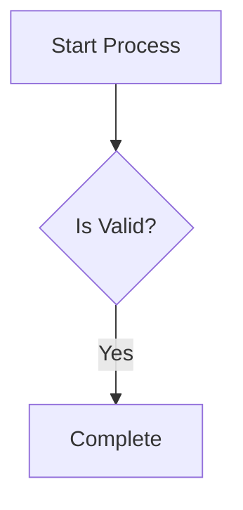
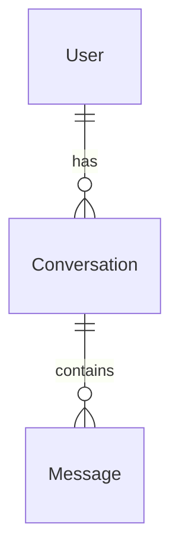
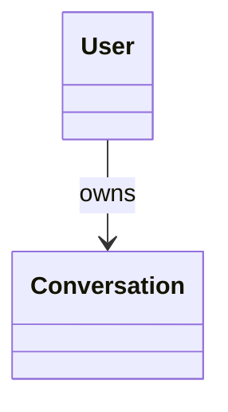

# DARE Backend Code Quality Rules

This document defines coding standards and patterns for the DARE backend. Follow these rules to maintain code quality, readability, and developer experience.

---

## 1. DTOs & Data Transfer

### Use Typed DTOs Instead of Parameter Sprawl

**Bad** - Function with 18+ parameters:
```python
async def build_standard_messages(
    request_message: str,
    conversation: Optional[Any],
    document_processor: DocumentProcessor,
    file_processor: FileProcessor,
    prompt_id: Optional[str],
    referenced_conversation_ids: Optional[List[str]],
    file_ids: Optional[List[int]],
    embedding_ids: Optional[List[int]],
    tag_ids: Optional[List[int]],
    folder_ids: Optional[List[int]],
    user_id: Optional[int],
    file_owner_id: Optional[int],
    is_socratic_mode: bool,
    similarity_threshold: float,
    max_context_snippets: int,
    history_limit: int,
    message_obj: Optional[Any] = None,
    workflow_run_step_obj: Optional[Any] = None,
) -> List[Dict[str, str]]:
```

**Good** - Clean DTO-based signature:
```python
async def build_standard_messages(
    request: LLMQueryRequest,
    document_processor: DocumentProcessor,
    file_processor: FileProcessor,
) -> List[Dict[str, str]]:
```

### DTO Design Principles

1. **Use frozen dataclasses** for immutability:
```python
@dataclass(frozen=True)
class LLMQueryRequest:
    message: str
    user: Optional[Any] = None
    context: ContextConfig = field(default_factory=ContextConfig)
```

2. **Group related fields** into nested configs:
```python
@dataclass(frozen=True)
class LLMQueryRequest:
    context: ContextConfig      # Document/history context
    generation: GenerationConfig # Temperature, tokens, etc.
    media: MediaConfig          # Images and media files
    socratic: SocraticConfig    # Teaching mode config
```

3. **Add helper methods** for common queries:
```python
def is_socratic_mode(self) -> bool:
    return self.socratic.enabled

def requires_web_search(self) -> bool:
    return self.generation.web_search_enabled
```

4. **No redundant DTOs** - Don't create intermediate DTOs that just extract fields from another DTO.

---

## 2. Separation of Concerns

### Module Organization

Reference: `core/services/vector_service.py`

```
core/services/
├── vector_service.py      # Service layer (orchestration)
├── document_processor.py  # Domain logic
├── llm_service.py         # LLM orchestration
├── llm_helpers/           # Helper modules
│   ├── db_helpers.py          # Database operations
│   ├── socratic_helpers.py    # Socratic message building
│   ├── standard_message_helpers.py  # Standard message building
│   └── semantic_context_helpers.py  # Vector search helpers
└── dtos/                  # Data transfer objects
    ├── request_dto.py
    ├── context_dto.py
    └── ...
```

### Abstract Base Classes for Extensibility

**Good** - Abstract base with multiple implementations:
```python
class BaseVectorService(ABC):
    """Abstract base class for vector database services."""

    @abstractmethod
    def upsert_vectors(self, vectors: List[Tuple], namespace: Optional[str] = None) -> bool:
        pass

    @abstractmethod
    def query_vectors(self, vector: List[float], top_k: int = 5) -> List[Dict]:
        pass


class PineconeVectorService(BaseVectorService):
    """Pinecone implementation."""
    def __init__(self):
        self.client = PineconeClient()

    def upsert_vectors(self, vectors, namespace=None):
        return self.client.upsert_vectors(vectors, namespace)


class WeaviateVectorService(BaseVectorService):
    """Weaviate implementation."""
    def __init__(self):
        self.client = WeaviateClient()
```

### Factory Functions for Service Selection

```python
def get_vector_service(user_id: Optional[int] = None) -> BaseVectorService:
    """Factory function to get the appropriate vector service."""
    if user_id is None:
        return WeaviateVectorService()

    user = User.objects.get(id=user_id)
    if user.vector_db == VectorDBChoice.PINECONE:
        return PineconeVectorService()
    return WeaviateVectorService()
```

---

## 3. Import Rules

### No Inline Imports

**Bad** - Inline imports inside functions:
```python
def process_data():
    from core.services.document_processor import DocumentProcessor  # NO!
    processor = DocumentProcessor()
```

**Good** - All imports at module top:
```python
from core.services.document_processor import DocumentProcessor

def process_data():
    processor = DocumentProcessor()
```

### Import Order

1. Standard library imports
2. Third-party imports
3. Local application imports

```python
# Standard library
import logging
from typing import List, Dict, Optional, Any
from dataclasses import dataclass, field
from abc import ABC, abstractmethod

# Third-party
from django.conf import settings
from asgiref.sync import sync_to_async

# Local application
from core.services.dtos import LLMQueryRequest
from core.services.document_processor import DocumentProcessor
```

### Export Explicitly with `__all__`

```python
# dtos/__init__.py
from .context_dto import ContextConfig
from .generation_dto import GenerationConfig
from .request_dto import LLMQueryRequest, LLMQueryChunk

__all__ = [
    "ContextConfig",
    "GenerationConfig",
    "LLMQueryRequest",
    "LLMQueryChunk",
]
```

---

## 4. Type Hints & Readability

### Strong Typing

**Bad** - Ambiguous types:
```python
def process(data, options):
    pass
```

**Good** - Explicit types:
```python
def process(data: LLMQueryRequest, options: Dict[str, Any]) -> List[Dict[str, str]]:
    pass
```

### Avoid `Any` Unless Necessary

Use `Any` only when:
- Avoiding circular imports (document in comments)
- Working with truly dynamic data

```python
# Using Any to avoid circular imports
user: Optional[Any] = None  # User model
```

### Type Aliases for Complex Types

```python
MessageList = List[Dict[str, str]]
VectorTuple = Tuple[str, List[float], Dict]

def build_messages(request: LLMQueryRequest) -> MessageList:
    pass
```

---

## 5. Error Handling

### Decorator Pattern for Consistent Error Handling

```python
def client_operation(func):
    """Decorator for standardized error handling in vector client operations."""
    def wrapper(*args, **kwargs):
        try:
            return func(*args, **kwargs)
        except Exception as e:
            operation_name = func.__name__
            raise Exception(f"Error in {operation_name}: {str(e)}")
    return wrapper


class WeaviateVectorService(BaseVectorService):
    @client_operation
    def upsert_vectors(self, vectors, namespace=None):
        return self.client.upsert_vectors(vectors, namespace)
```

### Graceful Fallbacks

```python
async def get_vector_service_async(user_id: Optional[int] = None) -> BaseVectorService:
    if user_id is None:
        return WeaviateVectorService()

    try:
        user = await sync_to_async(lambda: User.objects.get(id=user_id))()
        if user.vector_db == VectorDBChoice.PINECONE:
            try:
                return PineconeVectorService()
            except Exception:
                return WeaviateVectorService()  # Fallback
        return WeaviateVectorService()
    except Exception:
        return WeaviateVectorService()  # Default fallback
```

---

## 6. Documentation

### Module-Level Docstrings

```python
"""
Socratic Message Builders

Complete message construction for SocraticBooks classic and advanced modes.
These functions handle all logging, history retrieval, vector service init,
document context retrieval, and prompt assembly.
"""
```

### Function Docstrings with Args/Returns

```python
async def build_classic_socratic_messages(
    request: LLMQueryRequest,
    document_processor: DocumentProcessor,
) -> List[Dict[str, str]]:
    """
    Build complete message array for classic SocraticBooks mode.

    The classic format establishes the AI as a "living Socratic book" that helps
    students learn through dialogue.

    Args:
        request: LLMQueryRequest containing all query parameters
        document_processor: DocumentProcessor for vector similarity search

    Returns:
        List of message dicts ready for LLM API: [system_message, user_message]
    """
```

### Section Comments for Large Files

```python
# ============================================================================
# Public API - These are the only exports
# ============================================================================

async def build_classic_socratic_messages(...):
    pass

# ============================================================================
# Private Helpers - Internal to this module
# ============================================================================

def _format_transcript(history: List[Dict[str, str]]) -> str:
    pass
```

---

## 7. Async Patterns

### Sync-to-Async for Django ORM

```python
from asgiref.sync import sync_to_async

# Wrap ORM calls
user = await sync_to_async(lambda: User.objects.get(id=user_id))()
```

### Async Factory Functions

Provide both sync and async versions when needed:

```python
def get_vector_service(user_id: Optional[int] = None) -> BaseVectorService:
    """Sync version."""
    pass

async def get_vector_service_async(user_id: Optional[int] = None) -> BaseVectorService:
    """Async version with connection testing."""
    pass
```

---

## 8. Code Smells to Avoid

| Smell | Solution |
|-------|----------|
| 5+ parameters | Use a DTO |
| Inline imports | Move to top of file |
| Repeated field extraction | Pass the DTO directly |
| `Dict[str, Any]` everywhere | Create typed dataclasses |
| Copy-paste code | Extract to helper functions |
| Giant functions | Split into smaller, focused functions |
| Mixed abstraction levels | Separate high-level orchestration from low-level details |

---

## 9. File Naming Conventions

| Type | Convention | Example |
|------|------------|---------|
| DTOs | `*_dto.py` | `request_dto.py`, `context_dto.py` |
| Services | `*_service.py` | `llm_service.py`, `vector_service.py` |
| Helpers | `*_helpers.py` | `db_helpers.py`, `socratic_helpers.py` |
| Constants | `constants.py` | `conversations/constants.py` |
| Models | `models.py` | Standard Django convention |

---

## 10. Reference Implementations

### Clean Service Layer
See: `core/services/vector_service.py`
- Abstract base class
- Multiple implementations
- Factory function
- Consistent error handling

### Clean DTO Structure
See: `core/services/dtos/`
- Frozen dataclasses
- Nested configs
- Helper methods
- Explicit exports

### Clean Helper Modules
See: `core/services/llm_helpers/socratic_helpers.py`
- Clear public/private separation
- Focused functions
- Good documentation
- Consistent patterns

---

## Summary

1. **DTOs over parameter lists** - If a function has 5+ params, use a DTO
2. **Imports at top** - Never inline imports
3. **Strong typing** - Use type hints everywhere
4. **Abstract bases** - For extensible service layers
5. **Factory functions** - For service instantiation
6. **Consistent error handling** - Use decorators
7. **Clear documentation** - Module, class, and function docstrings
8. **Separation of concerns** - Helpers, services, DTOs in separate modules

---

## 11. Data Schema Design (BE-FE Contracts)

### Separate Fields for Different Data Types

When a field can contain different data structures based on context, **use separate named fields** instead of union types or generic fields.

**Bad** - Ambiguous field that requires FE to guess:
```python
# FE doesn't know what shape result is
"toolCall": {
    "id": tool_call_id,
    "result": tc.get("result"),  # Could be anything!
}
```

**Good** - Separate fields for each data type:
```python
# FE knows exactly which field to check based on serverSlug
"toolCall": {
    "id": tool_call_id,
    "serverSlug": server_slug,
    "dareResult": parsed_result if server_slug == "dare" else None,
    "mcpResult": parsed_result if server_slug != "dare" else None,
}
```

### Parse and Camelize Before Sending

Never send raw JSON strings to FE. Parse and camelize all nested data.

**Bad** - Sending JSON string:
```python
"result": json.dumps(tool_result)  # FE has to JSON.parse()
```

**Good** - Sending parsed, camelized object:
```python
def _parse_tool_result(self, result: str):
    if not result:
        return None
    try:
        parsed = json.loads(result)
        return camelize(parsed)
    except (json.JSONDecodeError, TypeError):
        return result

# Usage
"dareResult": self._parse_tool_result(tc.get("result"))
```

### Route to Correct Fields Based on Context

Use helper methods to build payloads with proper field routing.

```python
def _build_tool_call_payload(self, tc: dict) -> dict:
    """Route result to the correct typed field based on context."""
    server_slug = tc["server_slug"]
    parsed_result = self._parse_tool_result(tc.get("result"))
    
    payload = {
        "id": tc["tool_call_id"],
        "toolName": tc["tool_name"],
        "serverSlug": server_slug,
        "status": tc["status"],
        "error": tc.get("error"),
    }
    
    # Route to correct field based on server type
    if server_slug == "dare":
        payload["dareResult"] = parsed_result
    else:
        payload["mcpResult"] = parsed_result
        
    return payload
```

### Reference Implementation

See: `core/services/conversation_service.py`
- `_build_tool_call_payload()` - Routes to correct field
- `_parse_tool_result()` - Parses JSON and camelizes

This ensures:
- **Zero confusion** on FE about data shape
- **Type-safe** interfaces on FE
- **No parsing** needed on FE
- **10/10 readability** - clear what each field contains

---

## 12. Mermaid Diagram Syntax Rules

### Supported Diagram Types

The `create_diagram` DARE tool supports these Mermaid diagram types:

| Type | Mermaid Directive | Use Case |
|------|-------------------|----------|
| `flowchart` | `flowchart TD` | Process flows, workflows, decision trees |
| `sequence` | `sequenceDiagram` | API calls, user interactions, message flows |
| `mindmap` | `mindmap` | Brainstorming, hierarchical concepts |
| `pie` | `pie showData` | Data distribution, percentages |
| `state` | `stateDiagram-v2` | State machines, lifecycle diagrams |
| `class` | `classDiagram` | UML class diagrams, simple entity relations |
| `er` | `erDiagram` | Entity Relationship Diagrams, database schemas |

### Syntax Rules by Diagram Type

#### Flowchart (Default)



**Rules:**
- Node IDs: Use alphanumeric only (`step1`, `validate`, `process`)
- Reserved words (`end`, `graph`, `style`, `class`) must be prefixed: `node_end`
- Labels: Use quoted strings `["Label"]` for special characters
- Edge labels: Use `-->|label|` format

#### Entity Relationship Diagram



**Rules:**
- Entity names: Simple alphanumeric, no spaces
- Relationship labels: Must be quoted `"label"`
- Cardinality notation: `||--o{` (one-to-many), `||--||` (one-to-one)
- No parentheses in labels - use underscores

#### Class Diagram



**Rules:**
- Class names: Simple alphanumeric
- Relationship labels: After `:` with space
- No shape syntax - classes are always rectangles

### Reserved Keywords

Never use these as node IDs (auto-prefixed with `node_` in backend):

```python
MERMAID_RESERVED_KEYWORDS = {
    'end', 'graph', 'subgraph', 'direction', 'click', 'style', 'classDef',
    'class', 'linkStyle', 'callback', 'note', 'participant', 'actor',
    'loop', 'alt', 'else', 'opt', 'par', 'and', 'rect', 'state'
}
```

### Label Escaping

| Character | Replacement |
|-----------|-------------|
| `"` | `'` |
| `(` | `[` (unquoted) or kept (quoted) |
| `)` | `]` (unquoted) or kept (quoted) |
| `{` | `[` (unquoted) |
| `}` | `]` (unquoted) |
| `\n` | ` ` (space) |

### Reference Implementation

See: `core/services/llm_utils/diagram_tool.py`
- `_sanitize_node_id()` - Handles reserved keywords and special chars
- `_escape_label()` - Escapes labels for Mermaid syntax
- `_build_*_diagram()` - Type-specific diagram builders
